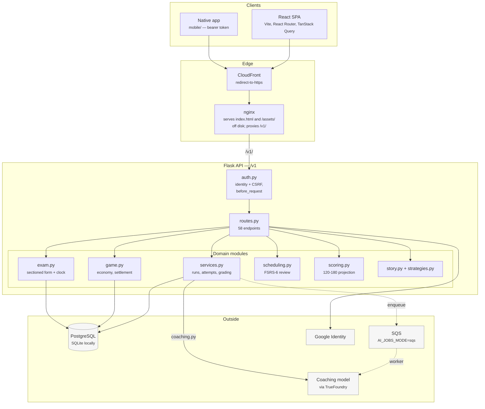
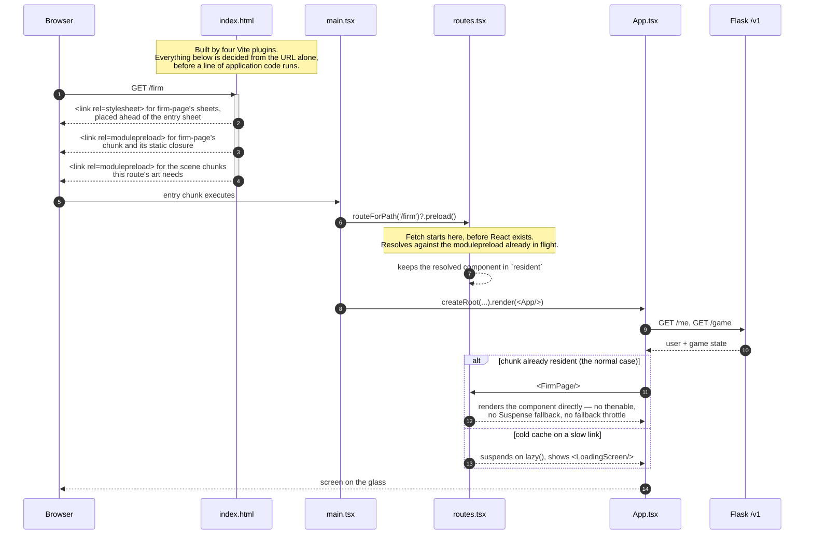
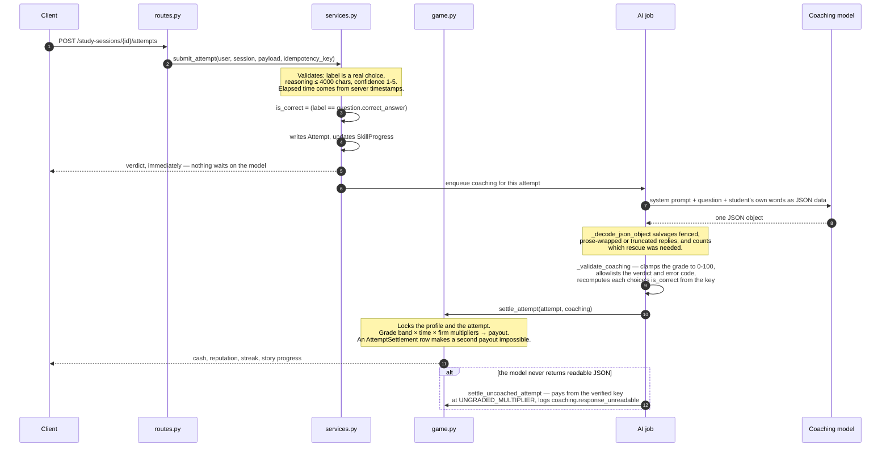

# Architecture

How the application is put together, and how routing works — which is the part
worth a diagram, because it is where most of the load-time engineering lives.

Companion documents: [`GAME-LOOP.md`](GAME-LOOP.md) for what the app *does*,
[`SECURITY.md`](SECURITY.md) for what protects it.

---

## The shape of it

Three deployable pieces and one shared API.

**The one-way rule inside the API.** `routes.py` validates and translates; it
holds no rules. `services.py` owns a study run and everything that happens to an
attempt; `game.py` owns money and never decides whether an answer was right;
`exam.py` owns the clock. `game.py` does not import `services.py`. `exam.py`
imports `services` only inside `close_section`, at call time rather than at
module scope, so the import graph runs one way while a module is loading and
both ways only while a section is being marked.

**Where correctness is decided,** once, in `services.submit_attempt`: the
selected label against `question.correct_answer`. Nothing downstream re-decides
it, and the coaching model is never asked.

---

## Routing

Nine screens, each its own chunk, each with its own stylesheets, and a
deliberate effort to make an already-downloaded screen render without a
fallback. Three mechanisms cooperate, and they are easier to read as one
sequence than as three features.

### 1. Per-route chunks

`routes.tsx` is the only place a screen is named. Each entry is a
`defineRoute(() => import('./pages/…'))`, so each page is a real dynamic import
and lands in its own chunk.

This matters more than it sounds. The nine screens used to be nine *named*
imports out of one 2,174-line `pages.tsx`, which is the same as no splitting at
all — a named import pulls the whole module in, so every route paid for all
nine. Wrapping those imports in `lazy()` would have changed nothing. Splitting
the file is what made the dynamic import real, and it took roughly 490 kB off
the entry bundle.

### 2. Per-route stylesheets, injected in front of the entry sheet

Six page sheets were once pinned to the entry bundle purely to fix their
*position*. Page sheets and `styles.css` restate each other's rules at equal
specificity, so a sheet that arrives late silently flips those ties — measured,
one of them widened the rival operations panel on `/story` by 37 px.
`mobile.css` is the same problem from the other side: a global override sheet
that wins by being last, so a page sheet landing after it takes the phone layout
back.

The `lsat-route-stylesheets` plugin in `vite.config.ts` holds that position in
the *document* instead of in the bundle. For the route being loaded it writes a
real `<link>` for each of that route's sheets, ahead of the entry sheet, and a
`MutationObserver` moves any that arrive later back in front of it. Same place
in the cascade, 27 kB gzipped off the stylesheet every screen blocks on.

`case-instrument.css` is the one that could not follow, and the reason is worth
keeping: it sat *after* `styles.css`, and a route sheet is emitted *before* the
entry sheet, which flips every tie between the two — including
`.case-instrument .case-timer small` against `.case-timer small`. It stays on
the entry.

### 3. Routes de-suspended

`lazy()` alone cannot render an already-loaded module without a fallback, and
the reason is easy to miss. `lazy()` chains a `.then()` onto the import to pick
the named export out of the module, and a `.then()` is pending for at least a
microtask however warm the module registry is. React therefore always found a
pending thenable on that first render, always committed the Suspense fallback,
and then held the real screen behind the *fallback throttle* — the delay that
exists to stop a fallback flashing past a reader. The main thread was measurably
idle across that gap: no long task, no request in flight, just a timer.

`defineRoute` keeps the resolved component in a closure. A route that already
has its component renders it on the first commit. A route whose chunk genuinely
has not arrived still suspends, which is correct for that case and is why the
`lazy()` form is kept rather than replaced.

The choice is pinned with `useState` at mount rather than read fresh each
render: if the module landed a moment after the route first rendered, letting
the choice change would swap the element type, and React unmounts the old tree
on a type change — the screen would be rebuilt and lose whatever the reader had
put into it.

### The route table

| path | screen | guard |
|---|---|---|
| `/login` | `login-page` | none |
| `/` | — | redirects to `me.next_route` |
| `/onboarding` | `onboarding-page` | signed in |
| `/progress` | `dashboard-page` | signed in + onboarded |
| `/cases` | `cases-page` | signed in + onboarded |
| `/cases/:sessionId` | `case-session-page` | signed in + onboarded |
| `/story` | `story-page` | signed in + onboarded |
| `/office` | `office-page` | + Focus Mode gate |
| `/firm` | `firm-page` | + Focus Mode gate |
| `/map` | `map-page` | + Focus Mode gate |
| `/practice`, `/practice/:id` | — | legacy redirects to `/cases` |
| `*` | — | redirects to `/` |

Two routes cannot be helped by any of the above, and both are gated on a
network answer rather than on their own code. `/login` cannot show its form
until `auth-config` replies — which is why it is also excluded from the
route-script hints, where it measured 20 ms *slower*. `/` cannot know which
screen it wants until `me` reports `next_route`, so it is the one route that
still legitimately suspends, and `routeForPath` deliberately returns `null` for
it rather than guessing.

### Speculative work must lose every race

Three separate warm-ups exist, and each had to be moved after it was measured
beating the screen the reader actually asked for.

- **The route's own scene** (`App.tsx`). Running `preloadArtForRoute` inline was
  free while every screen lived in the entry chunk. Once the routes became real
  dynamic imports it competed with them: on `/login` it pulled ~717 kB of
  three.js ahead of the 4 kB route chunk and pushed the `me` request from 54 ms
  to 729 ms. It is now split by what the scene is worth — immediate on `/office`
  and `/map`, where the scene *is* the page, and idle-deferred everywhere else.
- **The dock's scenes** (`DockWarmer`). `requestIdleCallback` fires happily
  while a route's chunk is still in flight, because the main thread genuinely is
  idle then — it is waiting on the network, not finished. Scheduled from `App`,
  that gap was enough for ~300 kB to land in front of the dashboard's own first
  data request, taking content on screen from 338 ms to 714 ms. It now renders
  inside the route's Suspense boundary, so it is tied to the commit of the
  screen itself.
- **The nav's hover preload.** `routeForPath` exists so a pointer heading at a
  nav item can start that screen's module. Same table, no second source of
  truth.

### The Vite plugins

All four live in `frontend/vite.config.ts` and all four write into
`index.html` at build time, so every decision below is made from the URL before
any application code runs.

| plugin | what it writes |
|---|---|
| `lsat-route-stylesheets` | each route's `<link rel=stylesheet>`, ahead of the entry sheet, plus the observer that keeps them there |
| `lsat-scene-preload-hints` | `modulepreload` for the 3D chunks a route's art needs |
| `lsat-redirect-route-hints` | on `/`, hints for the screen `next_route` is about to send the visitor to |
| `lsat-route-script-hints` | `modulepreload` for the route's own chunk and its static closure, for the eight paths that can name their screen from the URL |

The last one closed a gap of about 1.1 s. The stylesheets were in the document
at ~200 ms while the route's script was not requested until ~1300 ms, because
it could not be asked for until the entry and framework chunks had downloaded,
parsed and executed. Measured numbers and the method are in
[`tools/perf/FINDINGS.md`](../tools/perf/FINDINGS.md).

---

## Data flow for one answered question

The path that touches the most modules, and the one to read first.

The important property: **the student's verdict does not wait on the model, and
the model cannot change it.** Coaching is a 20–30 second frontier-model call
that runs off the settlement path. If it never arrives, the case still settles
from the verified answer key — only the prose portion of the reward is withheld.

`AI_JOBS_MODE` decides where that call runs, and the right answer is a property
of the deployment rather than of the code: `sync` in the request (correct for a
serverless container that may be frozen once the response is written), `local`
on a background thread (correct for a long-lived server), or `sqs` with a worker
draining the queue. Unset in production it warns loudly, because the symptom —
every answered question takes half a minute — is a long way from the cause.

---

## Where to start reading

| you want | read |
|---|---|
| the game and the study loop | [`docs/GAME-LOOP.md`](GAME-LOOP.md) |
| what an endpoint does | `backend/app/routes.py` — thin, one screenful per endpoint |
| why a run behaves as it does | `backend/app/services.py` |
| why a case paid what it paid | `backend/app/game.py`, `settle_attempt` |
| why a screen loads as it does | `frontend/vite.config.ts` and `frontend/src/routes.tsx` |
| what is safe and what is not | [`docs/SECURITY.md`](SECURITY.md) |
| what has been measured | [`tools/perf/FINDINGS.md`](../tools/perf/FINDINGS.md) |
