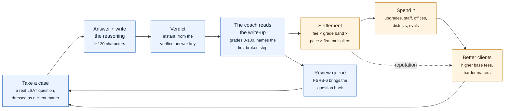
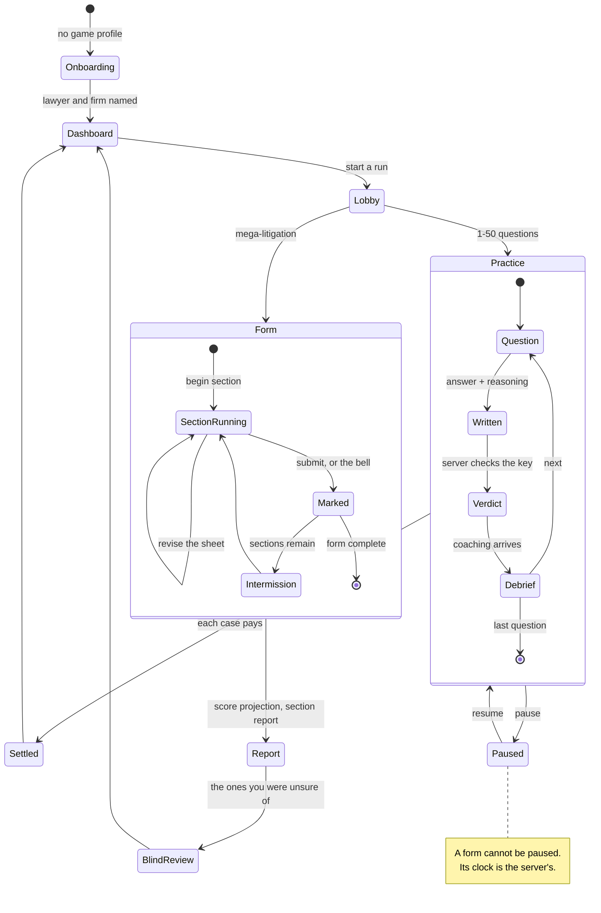

# The app, the game loop, and how they are the same loop

Lawyer Tycoon is an LSAT trainer wearing a business simulation. That framing is
not decoration on top of a quiz app: **the two loops are wired to each other at
one point**, and everything else follows from it.

That point is the *written explanation*. A student does not answer a question,
they file a case: they pick an answer and write, in at least 120 characters, the
reasoning that decided it. The answer determines whether the case is won. The
explanation determines what the win is worth. A guessed right answer and an
argued right answer are both correct and are not both worth the same, and that
asymmetry is the entire design.

Companion documents: [`ARCHITECTURE.md`](ARCHITECTURE.md) for how the code is
laid out, [`SECURITY.md`](SECURITY.md) for what protects it.

---

## The loop in one picture

The blue half is a study app. The orange half is a tycoon game. They share the
grade.

---

## The study half

### What a question is

Real LSAT questions from the `tasksource/lsat-lr` and `tasksource/lsat-rc`
datasets — Logical Reasoning and Reading Comprehension — seeded into
`questions`, each with five labelled choices, a verified correct answer, a
difficulty and a question type. Reading Comprehension questions hang off a
shared `passages` row so a set stays under its passage and in order.

### The four ways to sit them

| mode | what it is |
|---|---|
| **Practice run** ("cases") | 1–50 questions, chosen for you. Answer, write the reasoning, get the verdict and coaching one question at a time. This is the loop above. |
| **Mega-litigation** | The mock exam. A 77-item form in three timed sections, administered like the real thing. |
| **Blind review** | After a mega-litigation, the questions you were unsure of, again, with no clock and no score attached — the standard LSAT self-study drill. |
| **Review queue** | Whatever FSRS says you are about to forget, folded into practice runs. |

### The mega-litigation is a real form, not a long quiz

Two LR sections of 25 and one RC of 27, which is the modal shape of a modern
LSAT and the shape the score conversion assumes. `FORM_ITEMS` is 77 and the
form size is derived from it rather than configured separately — because those
were once two different numbers, and a 75-item form scored against a 77-item
table is a quiet two-item handicap. If a deployment overrides the size anyway,
the app logs a warning saying the form is short.

The administration rules are enforced server-side, in `backend/app/exam.py`:

- A section's deadline is a **column**, written when the section is begun. The
  client is handed `remaining_ms` and never supplies it. Closing the tab is not
  a pause and reopening it does not buy time back.
- A section is begun once and ends once. Sections are sat in order — reaching
  ahead is refused by name (`section_out_of_order`), not silently redirected.
- The bell is enforced by the *next request*, not by a sweeper, so there is no
  window in which an expired section is still writable.
- There is no pause. `pause` is a practice-run verb; a form answers
  `diagnostic_no_pause`.
- Answers go on a **sheet** and can be revised freely until the bell, which is
  how the real test works and is why a form does not reuse the practice run's
  one-question-at-a-time verbs.

Accommodations stretch every clock on the form by the same multiplier
(standard, 1.5×, 2×).

### The projected score

`backend/app/scoring.py` converts a raw score to the 120–180 scale using 59
published LSAC conversion charts, reweighting the student's accuracy to the
reference form's composition rather than counting raw items — so a short form
still projects correctly. The projection is reported with an uncertainty band
built from LSAC's own published standard error of measurement (2.6 scaled
points at two-thirds confidence) and the equating spread measured across those
59 charts (1.09).

### Spaced repetition

`backend/app/scheduling.py` implements **FSRS-6** — the Difficulty, Stability,
Retrievability model — transcribed from the reference implementation and the
published specification. It replaced a fixed (1, 3, 7, 21)-day ladder that had
two problems: it knew nothing about the item, so a question missed four times
and one nearly had both sat on the same rung; and it was calendar-gated, so a
student sprinting the week before their test date was told to come back on
Thursday.

Half-life regression (the Duolingo model) and DASH were both considered and
rejected for the same reason: they are *trained* models whose value is fitting
parameters on a large review log, and there is no such corpus here. FSRS ships
with published default parameters that work untrained, which is exactly the
property this app needs on day one.

A card whose next interval already exceeds 21 days stops taking a review slot.
It is not deleted — one lapse pulls it straight back.

### The coach

Every submitted explanation is read by a frontier model, which returns one JSON
object: a grade 0–100, a verdict, the **first** broken reasoning step (not
merely the wrong final answer) with a concrete replacement, an explanation of
why the credited choice works and why each of the other four fails, a
three-step solution method, and a one-line rule to carry forward.

Three things about it matter:

1. **It never decides correctness.** That is settled from the verified answer
   key before the model is called, and the model is explicitly told it may not
   dispute it. Every field it returns is validated, clamped or allowlisted; see
   [`SECURITY.md`](SECURITY.md).
2. **Nothing waits on it.** It is a 20–30 second call that runs off the
   settlement path. The student has their verdict immediately.
3. **If it never arrives, the case still settles**, from the verified key, at a
   reduced multiplier. An outage costs the prose portion of a reward, never the
   case.

The grading rubric is deliberately anti-snob. A formulaic voice is not a defect
— repeated sentence shapes, a checklist walkthrough, textbook phrasing and
plainly imitating a worked example are all fine, because beginners have not
developed a voice yet and the thing being graded is what they *identified*. The
bottom band, "Invalid", is reserved for a factual finding that no
question-specific reasoning is present: blank, filler, about a different
question, copied out of the stimulus, a verbatim repeat of an earlier
explanation, or no reason at all beyond asserting the answer. When the model is
genuinely torn between Invalid and Weak it is instructed to choose Weak.

---

## The game half

### The one number that connects them

`explanation_grade` lands in a band, and the band is the largest single input to
what a case pays.

| band | grade | correct answer | wrong answer |
|---|---|---|---|
| Excellent | 80–100 | full fee, +12 score points | 25% consultation fee, drop capped at 1.5 |
| Good | 50–79 | full fee, +10 score points | 15% consultation fee, drop capped at 2.5 |
| Weak | 25–49 | reduced fee, +4 score points | nothing, full reputation hit |
| Invalid | 0–24 | **thin win** — 35% fee | nothing, full reputation hit |

Three of these are deliberate softenings, each with a reason:

- **A well-argued miss still pays.** A wrong answer backed by Good or Excellent
  reasoning reflects real skill, so it earns a consultation fee and a capped
  reputation drop instead of nothing. A careless miss still earns nothing, so a
  correct answer stays clearly the most valuable outcome.
- **A correct answer graded Invalid is a *thin win*, not a loss.** The key is
  verified, so the student demonstrably solved the question; Invalid is one
  model's judgement of prose, and the same argument rewritten can land in a
  different band. Zeroing it would land hardest on beginners who reason
  correctly and write formulaically.
- **The two deterministic failures are excluded from that mercy** and keep the
  full Invalid consequences, because they are findings rather than judgements:
  no explanation at all, and an explanation repeated verbatim from an earlier
  case.

Pace is the third input. A correct answer with Good or Excellent reasoning earns
up to 4 more points for finishing inside the question's target time — but
*under* a quarter of the target earns nothing and caps the whole case at 8
points, because that is too fast to have read it. Time spent inside an enforced
strategy gate is subtracted before the pace is scored, so choosing to use a
taught method never costs money.

### What the money buys

- **107 firm assets** — upgrades that raise the payout multiplier, staff who add
  a flat bonus to decisive wins, and items that raise the streak cap.
- **15 office tiers**, from a Wooden Shack to a Planetary Justice Nexus. Each
  needs both cash and a reputation floor, and most need specific assets first.
- **69 clients**, unlocked by tier, reputation and holdings. A better client is
  a higher base fee on the same question.
- **38 districts** and **14 rival firms** on the career map — territory to hold
  and competitors to run operations against and eventually acquire.
- **Cosmetics** — a wardrobe for the lawyer, which the 3D rig needs on first
  paint on three different screens, so the *selection* travels with every game
  payload while the full catalog is a separate request.

### Reputation, upkeep and streaks

Reputation is the gate on tiers and clients, and it decays. A bigger office
charges rent, accrued continuously and settled whenever the profile is touched,
so an empire that stops working starts costing money. A run of validated wins
builds a streak that adds a capped bonus to each payout; a wrong answer resets
it to zero. A separate daily streak rewards showing up, with goals at 5, 10 and
20 cases a day.

### The story

Eight chapters and 19 quests. Story progress keys off *validated* wins — correct
with Good or Excellent reasoning — which is the same signal the economy pays on,
so the narrative cannot be advanced by guessing. An ungraded win (a coaching
outage) counts as validated, deliberately: an outage must not make the story
unreachable.

Choices are recorded and have mechanical consequences. Taking the public charter
in `charter_of_counsel`, for instance, multiplies the reputation bonus a client
win pays by 1.5 for the rest of the game.

### Clearing a mega-litigation promotes the firm — three times, once a day

A cleared form hands over a whole office tier: its price, its reputation floor
and its asset requirements, all at once. That was exploitable, so it is bounded
by a **24-hour cooldown** and a **lifetime limit of 3**. The promotion is
written to the ledger under its own kind, so the history is auditable rather
than inferred from a counter.

### The economy is settled server-side, once

`settle_attempt` in `backend/app/game.py` takes a row lock on the profile and on
the attempt, returns any existing settlement rather than paying twice, and is
keyed to an `AttemptSettlement` row that makes a second payout structurally
impossible. Every economy input is frozen into the session item's
`game_context_json` at the moment the question first becomes visible — the
client's base fee, the firm multiplier, the staff bonus, the streak cap — so
buying an upgrade mid-question cannot retroactively repay a case in flight.

No economy value is ever read from the client. The request body carries five
fields: which item, which label, the reasoning, a confidence 1–5, and the
strategy decision. Everything else is derived.

---

## Two things that are experiments, not features

**Strategy enforcement** (`backend/app/enforcement.py`,
`backend/app/strategies.py`). Some questions arrive with a suggested approach,
and on one arm choosing it also commits you to doing it: the answer is gated
until the steps are filled in. There is a way out — a stand-down — but it only
opens after the student has actually run into the gate, because forcing is meant
to shape behaviour rather than build dead ends. Every attempt records the
enforcement version it was collected under, and
`STRATEGY_ENFORCEMENT_ENABLED` is a kill switch rather than a tuning knob: it
changes what the treatment arm *is*, so a deployment has to be able to stop
producing it without a code change.

**Focus Mode.** An account preference that drops the Office, Firm and Career
World from every nav surface, keeping the app to the Dashboard and Practice.
Hiding the links was never a guard — all three still rendered by direct URL,
with no nav entry left to get back out of them — so those routes now explain
themselves and offer the two things a student could want: turn it off and open
the screen, or go back to the dashboard.

---

## Where a session actually goes

