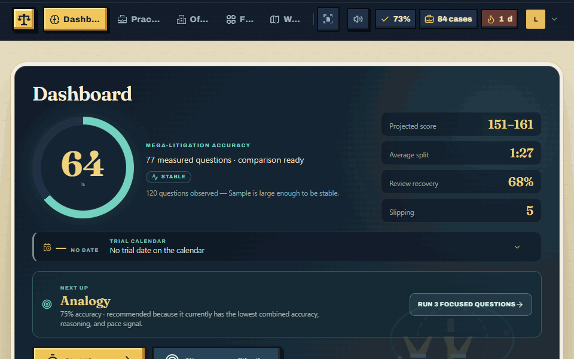
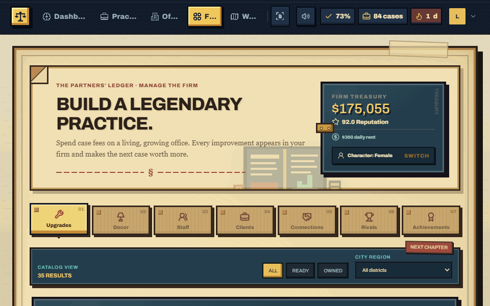
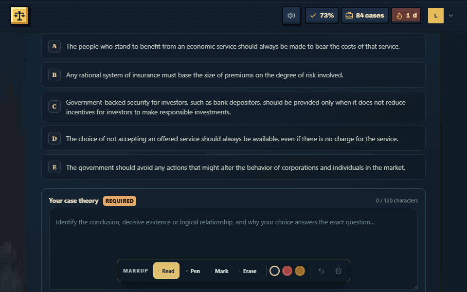
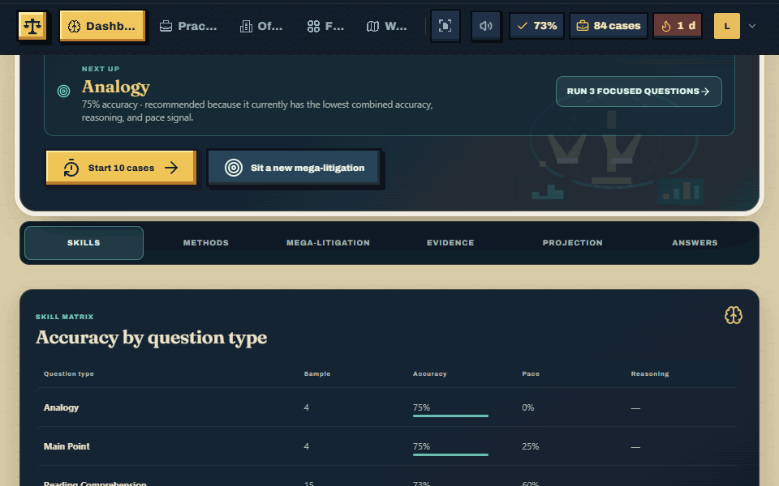
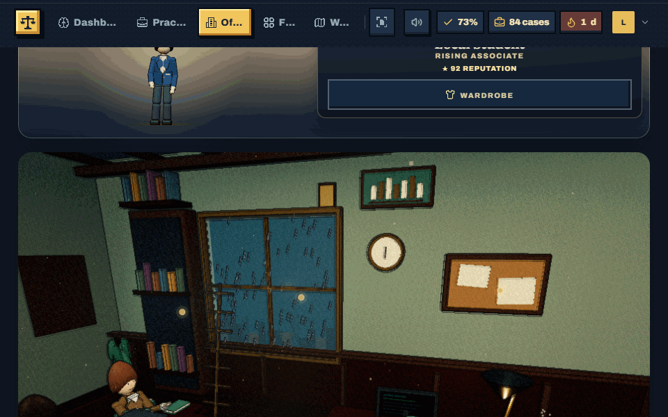
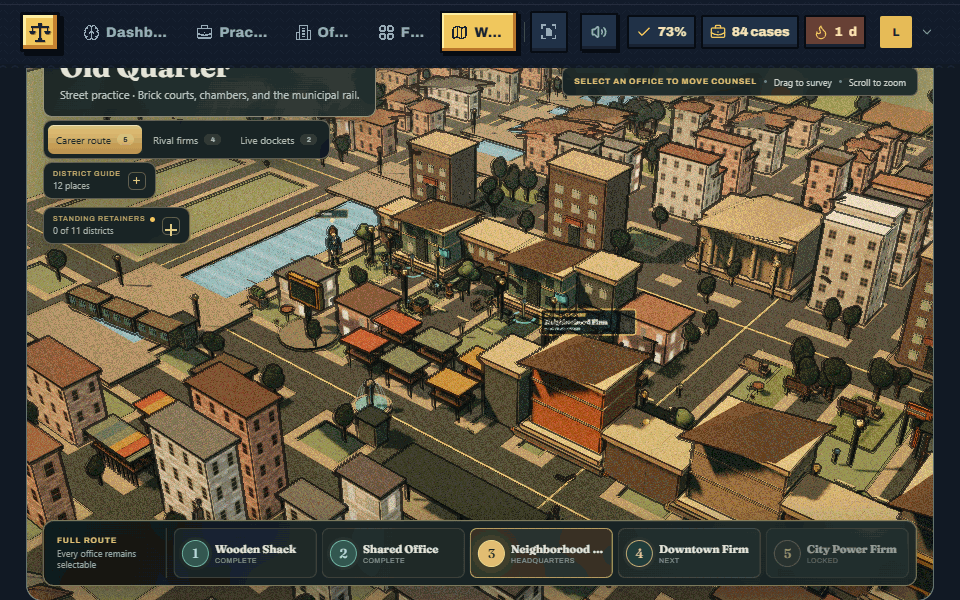

# Product demo GIFs

Short, real-app loops for product pages, release notes, and the repository README.

| Demo | What it shows |
| --- | --- |
|  | Mega-litigation accuracy, projected score, pace, review recovery, and detailed evidence. |
|  | Personalized LR/RC method comparisons and the evidence behind each recommendation. |
|  | The firm treasury, office-tier requirements, and purchasing an upgrade that increases case payouts. |
|  | The one-sitting mega-litigation gate, timer, and first exam question. |
|  | Selecting an answer, writing reasoning, rating confidence, and receiving the verified verdict. |
|  | The learner’s explanation, the coach’s first-error diagnosis, the clean reasoning process, and why each key choice succeeds or fails. |
|  | The living 3D headquarters and its orbit camera. |
|  | The career route, rival-firm layer, and animated world navigation. |

## Recreate the set

From the repository root, prepare the deterministic local learner:

```powershell
$env:DEV_AUTH_ENABLED='true'
.\.venv\Scripts\python.exe -m flask --app backend\run.py db upgrade
.\.venv\Scripts\python.exe backend\scripts\seed_demo_learner.py --apply --replace
```

Run the API on port 5001 and Vite on port 5173, then capture:

```powershell
$env:PORT='5001'
.\.venv\Scripts\python.exe backend\run.py

# In a second terminal
Set-Location frontend
npm run dev

# In a third terminal, also from frontend
npm run capture:demos
```

The capture uses an installed Chrome or Edge browser. Set `BROWSER_EXECUTABLE` when neither browser is in its standard location. `DEMO_BASE_URL`, `DEMO_OUTPUT_DIR`, `DEMO_WIDTH`, and `DEMO_HEIGHT` are optional overrides.

Set `DEMO_ONLY` to a filename or stem, such as `llm-reasoning-feedback`, to refresh one GIF without recapturing the complete set.

The answer loop records one local practice attempt. Re-run the demo learner seeder afterward when you want the exact baseline fixture restored.
