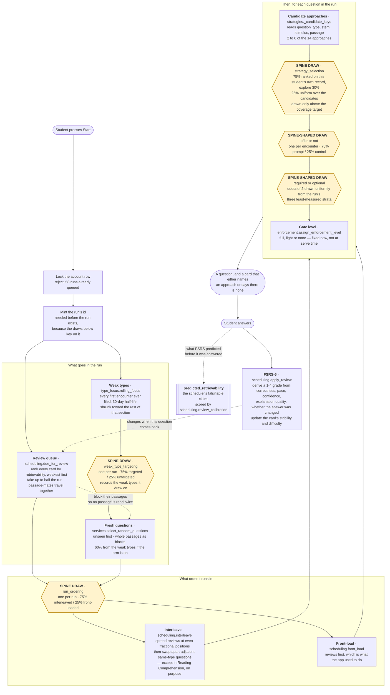
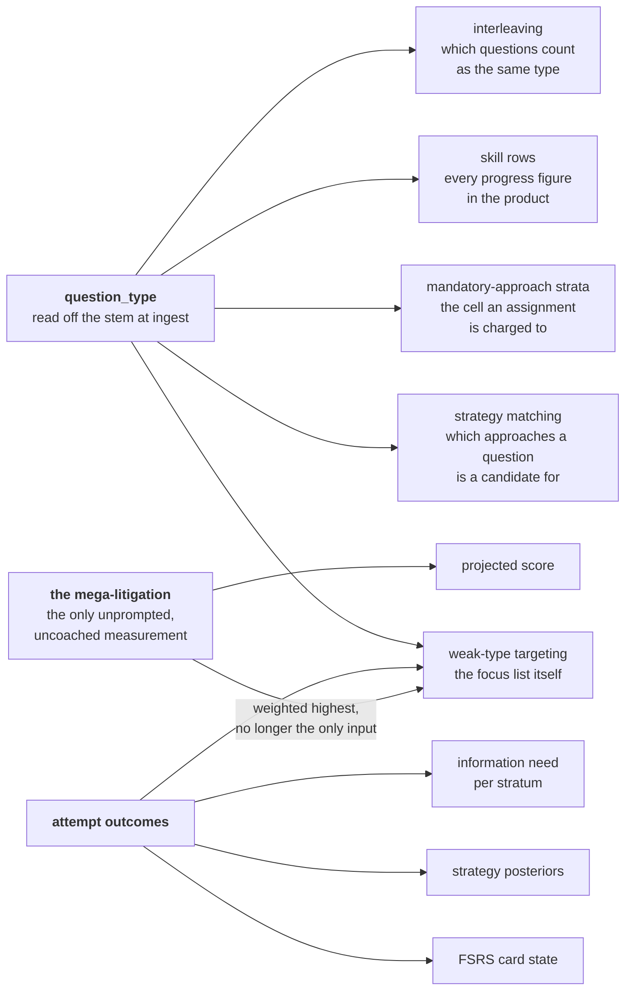

# The learning system

Everything the app decides about *what a student sees and when*, in one place.
It is written for someone who is going to have to make judgement calls about
this system without having built it. It does not restate the code; each section
says what shape the thing is and where the code lives.

The short version, and it is worth holding onto before the detail:

> **Eight independent layers decide what a student sees. Five can now be turned
> off for a comparison group, one is scored against its own predictions
> instead, and two are waiting on work that has not landed. None is shipped and
> unmeasured. No two layers solve the same problem — the architecture is sound.
> The problem had been that layers were arriving faster than the ability to
> tell whether they help, and that is what this branch closed.**

When this document was first written three layers were in a state called
`unmeasured`: shipped, deciding what students see, with nothing able to say
whether they helped. Those three were FSRS scheduling, run ordering, and the
bandit's choice of *which* approach to suggest. All three are now behind an
instrument, and one of the three is behind a deliberately weaker one — see
§4.5, which is the interesting case, because the honest answer there was that
the holdout should not be run.

---

## 1. The path from "start" to a question on screen

One request builds the whole run. Everything is decided up front and written
onto the run's rows, so what a student meets is fixed at the moment they press
start and cannot drift as they work through it.



Three things about this picture are worth saying out loud.

**The run is built once.** Every decision above is written onto `session_items`
before the student sees question one. Reloading the page, pausing overnight and
coming back, or answering out of order changes nothing about what was decided.
That is why a strategy card cannot change under a student mid-question, and it
is also why a bug in this path produces a whole run of wrong decisions rather
than an occasional odd one.

**The yellow boxes are the only randomised decisions.** Everything else is
deterministic given the student's history. That matters because randomised
decisions are the only ones whose effect can ever be estimated; everything else
is a rule, and a rule can only be judged by argument. There are five of them
now; two of those five were added by this branch, and one decision that could
not honestly be randomised — the scheduler — got the dotted box instead, which
is §4.5.

**Nothing in this path reads difficulty.** All 6,886 questions carry the same
value. A sibling agent is replacing it with a per-question Elo estimate; until
that lands, difficulty is a column, not a signal.

---

## 2. The eight layers

The canonical version of this table is `app/experiments.py`'s `LAYERS`
registry, and `python3 tools/audit/adaptive_layers.py` prints it. This is the
prose version. If they disagree, the registry is right and this file is stale —
that is deliberate, so drift is a thing you can catch rather than a thing you
assume has not happened.

### Measured today

| | |
|---|---|
| **`weak_type_targeting`** | |
| Decides | Whether 60% of a run's fresh questions come from the types this student is weak at, or from the whole bank. |
| Reads | `type_focus.rolling_focus` — every first encounter the account has ever filed, decayed on a 30-day half-life, each type compared against the student's accuracy on *the rest of* that section and shrunk toward it. Capped at five types. §4.6 is the whole design. |
| Signal absent | No type standing clear of its section means an empty list, and the run is built as if the layer were off. Those runs are left out of the draw entirely, because a treatment that does nothing on them would only dilute the comparison. |
| Read on | Later *first encounters* with the types the run leaned into — new questions of that category, in a later run. Not the run it steered, where a treatment that works looks like a harm, and not the review queue, where the treated arm created the cards. |
| Broken looks like | Every eligible run steering. Read `min_student_share` for the `untargeted` arm in the audit probe: it should sit near 0.25 for anyone with twenty runs. Before this work it was 0.0 for everybody, because the layer had no off arm at all. |
| **`run_ordering`** | |
| Decides | Where review items sit in the run, and whether two same-type questions may sit adjacent. Off arm is `scheduling.front_load`, which is what the app did before interleaving. |
| Reads | Which questions came from the queue, and each question's type. |
| Signal absent | A run with no review items, or one type-filtered by the student, is returned untouched and no arm is drawn — a filtered drill is a block the student asked for. |
| Read on | Those same questions' *next return* through the review queue, and **never pooled across the two sections**. Both halves are predictions made before the first observation; §4.4. |
| Broken looks like | A pooled lift appearing anywhere. `layer_reading` withholds it for this layer rather than merely discouraging it, because a figure present in a payload gets read. |
| **`strategy_selection`** | |
| Decides | *Which* approach is offered, given that one is: the student's own ranking, or a uniform draw over the candidates. |
| Reads | Per-approach posterior accuracy, pace, calibration and explanation quality over that student's prompt-arm attempts. |
| Signal absent | Under the coverage target the selector is already uniform over the least-sampled candidates, so no arm is drawn there — nor on a single-candidate question, where both arms return the same approach. |
| Read on | The offered question, restricted to the **prompt arm of `strategy_offer`**: "which approach" has no effect on a student who was shown none. The draw itself happens in both offer arms, which is not the same thing and is the subtle part; §4.7. |
| Broken looks like | The two draws correlating. `strategies.strategy_selection_health` compares the uniform share across the offer arms per student; if they diverge, restricting to the prompt arm has stopped being safe. |
| **`strategy_offer`** | |
| Decides | Whether a question shows a named approach or a card that names none. |
| Reads | The question's candidate approaches. |
| Signal absent | A question with no matching approach — in practice, none: every Logical Reasoning question is a candidate for at least `argument_core` and `prephrase`, every Reading Comprehension one for `passage_map` and `textual_proof`. The mega-litigation carries no trial by design. |
| Broken looks like | Exactly the failure found last night. A student's realised control share collapsing while the bank-wide share reads 25.0%. See §4. |
| **`strategy_forcing`** | |
| Decides | Whether a suggested approach can be declined, or must be completed before the answer is accepted. |
| Reads | Per-stratum information need: how thin the estimate in that approach-by-type cell is, multiplied by how often offers there are declined. Never accuracy. |
| Signal absent | A run whose strata are all well measured draws no pool, and its questions record a null forcing propensity — no counterfactual, so no part in the comparison. |
| Broken looks like | Rows in the pool carrying a propensity of 0 or 1, which means the pool was never a pool. `strategies._in_forcing_pool` already excludes those; a rising share of them is the signal. |

### Measured, but not by a holdout

One layer, and it is the only one in the product whose comparison group was
considered and then deliberately refused.

| | |
|---|---|
| **`review_scheduling`** | *calibrated* |
| Decides | When a question comes back. FSRS-6: every card carries stability and difficulty, the queue is ordered by current retrievability, and nothing gates on a date — a student who sits down at any hour is handed what they are closest to forgetting. |
| Reads | A 1–4 grade derived from correctness, pace against the item's own target, confidence, graded explanation quality, and whether the answer was changed. The student is never asked to rate anything. |
| Signal absent | A card with no stability reports retrievability 0 and sorts to the front, which is the right place for a question just missed. |
| Read by | `scheduling.review_calibration`, not by an off arm. FSRS states a predicted retrievability before every review; that prediction is recorded on the attempt and scored against what happened. |
| Broken looks like | A calibration curve that is displaced (the grade mapping is systematically generous or harsh) or flat (per-card memory state carries no information about recall, which is a null result for the entire layer). |
| Why not a holdout | Both the arithmetic and the ethics say no, and either alone would be enough. §4.5. |

### Registered and waiting

| | |
|---|---|
| **`run_sequencing`** | *seam* |
| Decides | Review-to-fresh ratio, section mix, review-slot jitter — instead of the fixed half-review, whole-passage default. |
| Reads | Queue pressure and the gap between the two sections' shrunk accuracies. |
| Signal absent | A cold account has no queue and no section gap, so the personalised shape and the fixed one coincide. The draw still happens; the comparison simply carries no contrast until there is history. |
| Status | Owned by the economy agent, landing in parallel. The registry entry and its arms exist so that work arrives measurable. One call to `experiments.assign` wires it. |
| **`difficulty_targeting`** | *planned* |
| Decides | Whether a run aims at a difficulty derived from the student's accuracy. |
| Reads | A per-question difficulty estimate, owned by the difficulty agent. |
| Signal absent | Today the signal is absent for the entire bank. **A layer whose signal is constant is not adaptive; it is a constant.** This layer must stay off until the Elo work lands. |

### Shipped, deciding, and compared against nothing

Empty, and that is the point of the heading. The registry had three entries in
this state and they were the substance of this branch. Keep the heading: a
census that counted only the measured layers would report a fully measured
system, and the honest way to show that is a section that can be empty and can
fill up again.

---

## 3. What reads what

The layers are independent in the sense that no two make the same decision.
They are not independent in the sense of not sharing inputs, and the sharing is
concentrated in one place.



One edge in that diagram moved this month. Weak-type targeting used to hang off
the mega-litigation alone: the signal was the types the student's last completed
form scored below its own average, and nothing else fed it. A student who was
consistently poor at necessary-assumption questions across two hundred ordinary
cases was not noticed as weak at that *category* by anything in the product.
The edge from `attempt outcomes` is what this branch added, and §4.6 is the
design. The mega-litigation is still the heaviest evidence in the signal — it is
the only measurement nobody coached — but it is no longer the only evidence.

`question_type` is the single most load-bearing column in the learning system,
and until this branch **45.8% of the bank did not have one**. 3,157 of 6,886
questions carried a type equal to their own section's name — "Logical
Reasoning" is not a kind of Logical Reasoning question — because that was the
fallback the old ten-pattern matcher returned when nothing matched. Four
mechanisms read the column and none of them could tell the difference, since
the placeholder is a plausible-looking string.

Reading the stems back, almost none of the misses were a question family nobody
had thought of. They were adjacency and inflection: `most strongly supported`
did not match "the statements above most strongly *support* which one of the
following" (127 stems, the largest single bucket); `vulnerable to criticism`
did not match "vulnerable to which one of the following *criticisms*", the same
words in the other order; `main purpose` did not match "the *primary* purpose
of the passage is to", 93 Reading Comprehension stems lost to one synonym.

Rules now live in `app/question_types.py`, ordered, each named and annotated
with what it claims. Placeholder types are down to 12.5%, and
`questions.question_type_source` records whether a type was inferred by a rule,
supplied by the bank, or fell through — so the remaining unknowns are countable
rather than estimated, which is the only reason the original 45.8% was findable
at all.

Two probes, both report-only and both runnable with no database:

```
python3 tools/audit/question_type_coverage.py    # coverage, movement, what each rule NEWLY matches
python3 tools/audit/strategy_candidates.py       # what the types do to strategy matching
```

The second one is the reason this was worth doing rather than a tidy-up:
questions with only two candidate approaches went from 44.8% to 36.6% of the
bank, with `scope_precision` gaining 280 questions, `conditional_chain` 201 and
`flaw_abstraction` 123. A two-candidate question is a two-armed bandit.

---

## 4. The measurement spine

### 4.1 The failure it generalises

The strategy trial's control arm was a hash of `(student, question, slot,
style)`. Across the hash space it drew 25%, exactly as designed, and every
bank-wide check agreed with it. For an individual heavy user it collapsed to
near zero, because a review question returning to the same slot re-drew the
same arm forever and the review half of a run is a small recirculating set.

Two things were wrong and they are different mistakes.

**The draw did not vary over the thing being estimated.** A draw that cannot
say *which encounter* it belongs to is not a draw. The fix was to make the
encounter a required input.

**The instrument was pooled.** The control share was measured across the bank,
which is an average over students, and the quantity that had broken was per
student. The number was correct and useless.

### 4.2 What the spine does about each

`app/experiments.py` is small on purpose. Three ideas.

**A layer is declared, not discovered.** `LAYERS` is one dictionary and one
place to read what the system is doing to a student.

**An assignment needs an exposure, and the exposure has a type.** A layer
declares the unit its effect is a property of — student, run, or encounter —
and `assign` takes a keyword-only `Exposure` whose kind must match. Handing "the
student" to a layer randomised per run is a type error at the call site, not a
comment in a docstring. The `Exposure` constructors are the only way to build
one:

```python
experiments.assign("weak_type_targeting", user.id, exposure=Exposure.run(session_id))
```

**The recorded propensity is the realised one.** The row keeps the probability
of the arm that was *actually* drawn, computed from the shares in force at the
moment of the draw, alongside the design version those shares belong to. A
later inverse-propensity or CACE fit reads that column and has to be able to
trust it, including after somebody retunes a holdback.

Structure alone is not enough, so the second guard is a measurement.
`assignment_health` reports the realised arm share **per student**, the number
of distinct exposures behind the draws, and how many students with enough draws
sit far from the design. Pointed at a hand-built collapse — forty ordinary
accounts and two heavy ones frozen at 2% — it reports 20.4% pooled, which is
what everyone read last night, and a minimum student share of 2%, which is what
was true. That test is in `backend/tests/test_experiments.py`, and it exists
because an instrument that has only ever been pointed at working data has not
been tested.

### 4.3 Registering a new layer

Seven steps now rather than five. The two that were added are the ones the
three registrations in this branch turned out to need, and both are about
*when* and *over what* a layer is read rather than how it is drawn — which is
the half that was missing, and the half most likely to turn a benefit into a
reported harm.

1. **Say what the effect is a property of.** A persistent setting the student
   keeps is `student`. Something re-decided each sitting is `run`. Something
   decided per question is `item`. Getting this wrong is the original bug.
2. **Add a `Layer` to `LAYERS`** with its question, its signal, what it does
   when the signal is missing, its arms and which one is *off*. Every layer is
   measured against its own absence, never against another layer.
3. **Say when the effect is expected.** `outcome_window` is `immediate`,
   `delayed`, or `later_encounters`. Ask whether the treatment is supposed to
   make the run it is applied to *better* or *harder*. Interleaving and
   weak-type targeting both make it harder on purpose, so the immediate reading
   points the wrong way and is available only if you ask for it by name.
4. **Say what must never be pooled.** `strata` names a variable whose levels a
   single figure would average across. Set it where you can predict, in
   advance, that two levels will disagree — and write down the prediction, so
   the split is a hypothesis rather than a slicing exercise.
5. **Call `assign` at the point of decision**, with an `Exposure` of the
   matching kind, and branch on `.on`. If the layer's population depends on
   something that is only true at the moment of the draw, pass it as `signal`;
   a population you cannot reconstruct later is a comment, not a restriction.
6. **Draw only where the layer could act.** A run the treatment is a no-op on
   should not be enrolled; it dilutes the comparison. Eligibility must be
   decided from facts fixed before the draw, never from anything downstream of
   the arm.
7. **Add the layer to this document.** The registry and this table are meant to
   be checked against each other.

A holdback of a quarter is not free: one run in four is built by the simpler
rule. It buys the only thing that can ever distinguish a layer that helps from
a layer that feels like it should.

### 4.4 Reading a layer in the wrong window reports the opposite result

This is the mistake that would have been made, and it would not have looked
like a mistake. `run_ordering` interleaves review items through a run instead
of serving them first. The entire literature it comes from — Rohrer, and the
desirable-difficulty work under it — is about performance on a *later* test.
Interleaved practice reliably looks worse while it is happening, because the
student keeps switching between kinds of question rather than grooving one. So
a reading taken on the answers given inside the assigned run would report a
working treatment as a harmful one, with a large sample and a confident
interval.

`layer_reading` therefore defaults to the window the layer declared, and both
of the layers registered here declare something other than `immediate`:

| layer | read on | why not the run it was drawn for |
|---|---|---|
| `run_ordering` | those same questions' next return through the review queue | interleaving trades present accuracy for retention |
| `weak_type_targeting` | later *first encounters* with the types the run leaned into | a run full of your worst type is harder; and the review queue is not neutral either, because the targeted arm creates more of those cards by serving more questions you were likely to miss |

The immediate reading is still available by passing `window="immediate"`, and
it comes back labelled with the declared window beside it, because the cost
side of a trade is worth seeing — it just must not be mistaken for the result.

`run_ordering` also declares `strata="section"`, and the reason was on the
record before the first observation: `research/01-learning-science.md` carries
Brunmair and Richter's meta-analysis at g = 0.42 for interleaving overall and
g = 0.01 — a null — on expository text. Reading Comprehension is expository
text. A pooled figure would average a real Logical Reasoning effect against a
Reading Comprehension null and understate both, so this layer has no pooled
figure at all: `layer_reading` withholds it rather than discouraging it,
because a number present in a payload gets read.

That prediction is also acted on in the mechanism, not only in the analysis.
`scheduling.BLOCKED_SECTIONS` says Reading Comprehension is not de-blocked, so
passage-mates stay together — which is what the evidence says is better for
that section, and is a decision rather than an accident.

### 4.5 The layer that should not have a holdout

FSRS is the strongest layer in the product by prior, and it is the one where a
comparison group would have been indefensible. Two independent reasons, either
sufficient:

**The arithmetic.** A schedule cannot coherently flip between runs — a card put
on a 21-day interval by one arm is still on it when the next run starts — so
the exposure has to be per student. That means the sample grows at the rate
accounts are opened rather than the rate questions are answered, and the
answers inside one account are heavily correlated.
`python3 tools/audit/measurement_cost.py` puts the holdout at **3,483
students** for a three-point difference in review accuracy, against 98 to 136
for the run-level layers. This app does not have them.

**The cost.** The off arm is not a milder treatment. It is a scheduler the team
believes is worse, shipped to a quarter of students for the entire life of a
trial that cannot finish, and nobody can be released from it early for the same
reason the exposure is per student.

So the instrument is a calibration check instead, and it is stronger than it
sounds. FSRS states a predicted retrievability for every card at the moment it
is served, which is a falsifiable claim on every single review, scorable
against what happened with no comparison group at all. That prediction is now
recorded on the attempt, and `scheduling.review_calibration` bands it and
reports the gap between predicted and actual plus a Brier skill score against
knowing nothing.

The part most likely to be wrong is not FSRS. It is `derive_grade`, this app's
own invention, mapping pace, confidence, explanation quality and whether the
answer was changed onto the four grades FSRS expects — the one part of this
layer with no literature behind it. A wrong grade mapping produces wrong
stabilities, and wrong stabilities show up as a calibration curve that is
displaced or flat. Cost: **113 reviews** in the 92% band for a ±5 point reading
there, about **450 across the whole curve** — against 3,483 students for the
holdout. Three orders of magnitude cheaper, no control group, and it can return
a null: a flat curve means the per-card memory state carries no information
about recall, which is a negative result about the entire layer.

`calibrated` is a registry status of its own precisely so this cannot be read
as "somebody got to it". It is a weaker instrument, honestly labelled, chosen
over a stronger one that could not be run.

### 4.6 Noticing a weakness, rather than remembering a verdict

The mental model users have of this app is that it notices which question types
they are weak at and serves more of those. Until this branch that was not what
happened. The weak-type signal read **one run** — the last completed
mega-litigation — and returned the types that came in under that run's own
average. A student who had never sat a form was invisible to it; a student who
had improved was still being fed what their last sitting said; and a student
consistently poor at necessary-assumption questions across two hundred ordinary
cases was noticed by nothing.

That was a reasonable design when nearly half the bank had no type to target.
It is not reasonable now that 12.5% do.

`app/type_focus.py` replaces the signal. Six decisions, each of which changes
the answer:

**Every first encounter, decayed rather than windowed.** A hard cutoff throws
away evidence at an arbitrary age and makes the signal jump when a run falls
out of the window. A 30-day half-life answers the question a fixed window is
trying to answer — *is this still true of the student?* — continuously. A
student who has genuinely improved stops being fed their old weakness because
the old evidence gets lighter, not because a date passed.

**Review returns are excluded.** This is where the double-counting would have
been, and the economy agent's reasoning about the review-share knob is the
reason it was looked for: a wrong answer already creates the card and already
sets its decay rate. Counting the return as *further* evidence of weakness in
the type would be the third time one wrong answer moved something, and it would
be self-confirming, since the questions that come back are selected for having
been missed.

**Each type is compared against the rest of its own section**, not against the
bank and not against the section including itself. Comparing within the section
is what keeps this from duplicating the section-mix knob, which already leans
on the gap *between* sections; comparing against the rest rather than the whole
is what makes the two rates disjoint, so the difference is not partly the type
against itself.

**Shrunk toward that baseline**, in the house style already used by the
projected score and the per-section strategy rankings, with an Agresti-Coull
interval and a minimum effective sample. Three wrong out of four is not
evidence, and the interval says so rather than a hand-tuned threshold.

**The mega-litigation still counts for more.** It is the only measurement in
the product nobody coached, so it carries a heavier evidence weight than an
ordinary prompted case. It is no longer the only input; it is the best one.

**Placeholder types can never be named a weakness.** A bucket holding an eighth
of the bank is not a category. They are still *served* —
`python3 tools/audit/type_targeting.py` measures them at 6.4% of a targeted run
against 10.5% of an untargeted one, a reduction bounded by the 60% fill ratio
and visible rather than hidden.

**This subsumes the old mechanism; it does not sit beside it.** There is one
weak-type layer. Two mechanisms both claiming to target weakness would be the
duplication this branch exists to end, and a second arm comparing the two
signals would spend observations to answer a question — "is more evidence
better than less?" — whose answer is not in doubt. The registry entry carries a
new `design_version` so runs assigned under the old signal are never pooled
with runs assigned under the new one.

### 4.7 Nesting: measuring the bandit inside the trial that offers it

`strategy_selection` asks whether ranking the candidate approaches on a
student's own record beats picking one of them uniformly. That question is only
defined for a student who is shown an approach at all, so the analysis is
restricted to the prompt arm of `strategy_offer`.

The mechanism, though, is deliberately *not* nested, and the distinction is the
whole difficulty of this layer. Drawing the selection arm only when the offer
came out `prompt` would break the offer trial: a control row carries the
approach that *would* have been offered, and `_section_reading` compares an
approach's prompt rows against that same approach's control rows. If treated
approaches were chosen by a mixture of ranked and uniform while control
approaches were chosen by ranked alone, the two arms would be labelled by
different processes and the comparison would stop being about the offer.

So the draw happens on every eligible question in both offer arms, and the two
randomisations are made independent by construction: `assign_strategy_trial` no
longer feeds the chosen approach into the offer arm's hash, which it used to.
Independence is what makes restricting to the treated arm safe, and it is
checked rather than asserted — `strategies.strategy_selection_health` compares
the uniform share across the two offer arms per student.

What the off arm is *not* is a fix for the bandit's known defect. An approach
that goes 1-for-3 in the coverage phase has its posterior pinned there and is
shut out of the exploit branch, which reads only the top two.
`python3 tools/audit/rank_reachability.py` re-runs the finding with outcomes
fed back and shows what releases it, which is not what you would hope. The
uniform arm reaches every rank by construction, and a quarter of eligible
questions spent on it is the price of finding out what the ranking is worth.

### 4.8 What each layer costs to measure

A holdback is a promise to spend observations, and the promise is worth pricing
before it is made. `python3 tools/audit/measurement_cost.py` computes, for each
layer, the answers needed at 80% power against the effect that layer plausibly
produces, inflated by clustering (answers inside one run are correlated) and by
how many separate cells the layer's question really contains.

| layer | answers to watch | students | note |
|---|---:|---:|---|
| `run_ordering` | 36,284 | 136 | per section, never pooled |
| `weak_type_targeting` | 47,100 | 98 | cheapest, and interference dilutes toward the null |
| `strategy_selection` | 100,480 | 126 | |
| `review_scheduling` | 348,331 | 3,483 | the holdout that is not running |
| `strategy_offer` | 468,907 | 1,563 | × 28 cells: 14 approaches × 2 sections |

Two things fall out of that table. The rolling weak-type layer is the cheapest
question in the product to answer, which is the argument for having registered
it rather than shipping it on for everyone — it arrives measurable at the
lowest price of anything here. And the strategy trial is the most expensive by
an order of magnitude, because it is not one question but twenty-eight, which
is the arithmetic behind `docs/strategy-apparatus.md`.

### 4.9 Reading it back

```
python3 tools/audit/adaptive_layers.py                                   # the census
python3 tools/audit/adaptive_layers.py --database-url <url>              # realised shares, per student
python3 tools/audit/adaptive_layers.py --database-url <url> --reading    # and the outcome comparison
```

`layer_reading` is intention-to-treat over the assigned arm, Hájek-weighted by
the recorded propensity, with both arms shrunk toward *no difference*. It moves
off the null in proportion to evidence, which for a quarter holdback takes a
while. That is the honest behaviour and it will look disappointing: a thin
comparison should report something near zero rather than something dramatic.

---

## 5. How to tell if this is broken

Ordered by how easily each failure hides.

**A pooled number that is right.** The class of failure this whole document is
organised around. Any share, rate or balance check that averages over students
can be correct while the per-student version is catastrophic. Always ask for
the minimum, not the mean.

**A layer with a constant signal.** `difficulty_targeting` would "work" today —
it would draw arms, record propensities and produce a reading — and the reading
would be noise, because every question in the bank has the same difficulty. A
layer reading a constant is a random number generator with a job title.

**A placeholder that reads like data.** 45.8% of the bank was routed by a
string that looked exactly like a question type. The general form: a fallback
value in the same domain as the real values. `question_type_source` exists so
this particular one is countable; the pattern will recur elsewhere.

**An improvement that is a relabelling.** A classification rule that widens
improves its coverage number whether it is right or wrong, so coverage alone
cannot catch an over-reach. `question_type_coverage.py` reports what each rule
*newly* matches and every row that changed a type it already had, which is what
caught three over-reaches in this work — `method of` claiming "an effective
method of falling asleep" among them.

**A run that looks steered because it was going to be anyway.** If eligibility
for a layer's draw were decided from anything downstream of the arm, the
comparison would be between two groups selected on the outcome. This is why
weak-type targeting decides eligibility from the rolling signal as it stood
*before* the run was built, and records it.

**An outcome the treated arm created.** The subtler cousin of the above, and
the one that nearly caught the targeting layer. Reading it on the review queue
would have looked careful — a delayed window, real retention, the same
questions coming back — and would have been meaningless, because the targeted
arm serves more questions the student is likely to miss and therefore *creates*
more of the cards it would then be judged on. The two arms would have been
compared on differently-composed material. Ask, of any outcome set: could the
treatment have changed which observations are in it, rather than only their
values?

**A number nobody can re-run.** Every figure in this document and in
`docs/audits/` names the probe that produces it, and the probes are checked in.
This is not tidiness. Two of the audit's figures did not survive being
re-measured, and one of them was a single seed of a random process reported as
a fact — which is a mistake anyone can make once and nobody can catch without
the script.

**A gate that is a nag.** Enforcement's own rule is structure over complaining:
a gate makes the wrong order impossible rather than objecting afterwards. Where
that is not achievable a gate is labelled `moderate` and the weakness is
written into the gate definition. A gate whose weakness note is missing is
claiming more than it does.

---

## 6. Deliberate omissions

**There is one case shape, and the selector that pretended otherwise is gone.**
`PRACTICE_STYLES` held exactly one value, `"cases"`, so `practice_style` was a
parameter that could not vary, validated against a set of one, and guarded
against in a branch testing for a value nobody could pass. It has been deleted
rather than documented. What looks like two shapes is one selector plus one
rule: Reading Comprehension questions on a shared passage form an indivisible
block, and everything else is a block of one. A run comes out as a mixed set of
argument questions, or as a set containing one whole passage, from the same
code path.

The invariant that branch was nominally protecting — the mega-litigation
carries no strategy trial — is real, and is now held where it is true.
`create_diagnostic_session` and the sectioned form build their items without
ever calling `assign_strategy_trial`, and the tests assert it on the items
rather than on a function's willingness to refuse.

**`Attempt.strategy_applied` is not treatment.** It is a self-report about a
private mental act. Every estimate in the system defines treatment by the arm
that was *assigned*; the self-report is shown back to students as a compliance
rate and never decides membership. Sorting on it would compare the questions a
student recognised against the ones they did not.

**Nothing in the product ever says an approach is confirmed.** A per-student
verdict on one of fourteen approaches needs on the order of thousands of
observations. The dashboard names a leader only once the *thinner* side of a
comparison is worth at least ten questions, and calls it a running total.

---

## 7. Where the code is

| | |
|---|---|
| `app/experiments.py` | The spine. Registry, exposure-typed assignment, realised propensity, health check, windowed and stratified ITT reading. |
| `app/question_types.py` | Type inference from the stem, with provenance. |
| `app/type_focus.py` | The rolling weak-type signal, and the cohort reading over it. |
| `app/scheduling.py` | FSRS-6, grade derivation, retrievability ordering, interleaving, `front_load`, and the calibration instrument. |
| `app/focus.py` | Weak types from the last mega-litigation. Still read for the sitting's own breakdown, no longer what steers a run. |
| `app/services.py` | `create_study_session` — the path in §1. |
| `app/strategies.py` | Catalogue, candidate matching, the bandit, the offer trial, mandatory-approach planning, the dashboard reading, and the pooled cohort estimate. |
| `app/enforcement.py` | Gate definitions and the deterministic checks behind them. |

Every probe, all report-only, and all but two runnable with no database at all:

| | |
|---|---|
| `tools/audit/adaptive_layers.py` | The census, and realised allocation per student. |
| `tools/audit/measurement_cost.py` | What each layer costs to measure, and in what order they would answer. |
| `tools/audit/question_type_coverage.py` | Type coverage, movement, per-rule newly-matched. |
| `tools/audit/strategy_candidates.py` | What the types do to strategy matching, and how much practice an approach needs before it can be ranked. |
| `tools/audit/strategy_trial_population.py` | The pooled trial and selection readings, with intervals. |
| `tools/audit/type_targeting.py` | Targetable types, placeholder exposure, and the cohort reading by history depth. |
| `tools/audit/rank_reachability.py` | Whether an approach shut out of the bandit's exploit branch is ever offered again. |
| `tools/audit/control_arm_exposure.py` | The control-arm collapse, under the old seeding and the new. |
| `tools/audit/section_reach.py` | How much Reading Comprehension a fresh practice budget can admit. |

| | |
|---|---|
| `docs/strategy-apparatus.md` | The recommendation on the strategy machinery. |
| `docs/audits/interleaving-audit.md` | A dated audit, annotated with what has since been fixed, what stands, and what did not reproduce. |
| `docs/measurement-spine-notes.md` | Merge notes, including the one failure in this change that would be silent. |
