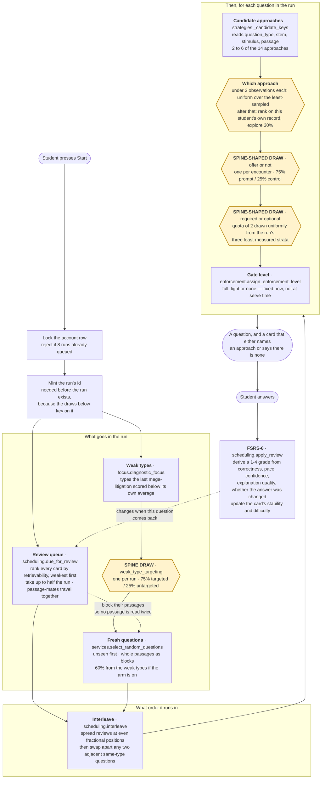
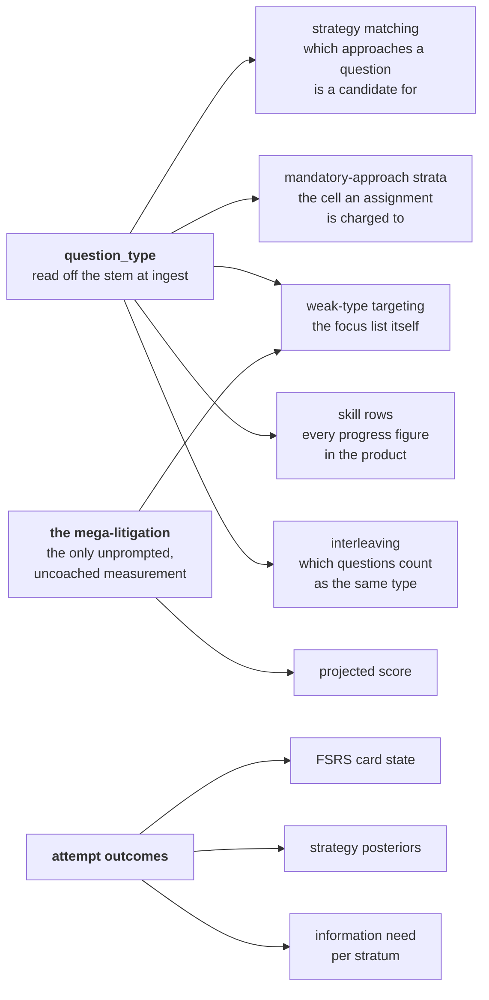

# The learning system

Everything the app decides about *what a student sees and when*, in one place.
It is written for someone who is going to have to make judgement calls about
this system without having built it. It does not restate the code; each section
says what shape the thing is and where the code lives.

The short version, and it is worth holding onto before the detail:

> **Eight independent layers decide what a student sees. Three of them can
> currently be turned off for a comparison group; three cannot; two are waiting
> on work that has not landed. No two layers solve the same problem — the
> architecture is sound. The problem is that layers have been arriving faster
> than the ability to tell whether they help.**

---

## 1. The path from "start" to a question on screen

One request builds the whole run. Everything is decided up front and written
onto the run's rows, so what a student meets is fixed at the moment they press
start and cannot drift as they work through it.



Three things about this picture are worth saying out loud.

**The run is built once.** Every decision above is written onto `session_items`
before the student sees question one. Reloading the page, pausing overnight and
coming back, or answering out of order changes nothing about what was decided.
That is why a strategy card cannot change under a student mid-question, and it
is also why a bug in this path produces a whole run of wrong decisions rather
than an occasional odd one.

**The yellow boxes are the only randomised decisions.** Everything else is
deterministic given the student's history. That matters because randomised
decisions are the only ones whose effect can ever be estimated; everything else
is a rule, and a rule can only be judged by argument.

**Nothing in this path reads difficulty.** All 6,886 questions carry the same
value. A sibling agent is replacing it with a per-question Elo estimate; until
that lands, difficulty is a column, not a signal.

---

## 2. The eight layers

The canonical version of this table is `app/experiments.py`'s `LAYERS`
registry, and `python3 tools/audit/adaptive_layers.py` prints it. This is the
prose version. If they disagree, the registry is right and this file is stale —
that is deliberate, so drift is a thing you can catch rather than a thing you
assume has not happened.

### Measured today

| | |
|---|---|
| **`weak_type_targeting`** | |
| Decides | Whether 60% of a run's fresh questions come from the types the last mega-litigation scored worst on, or from the whole bank. |
| Reads | `focus.diagnostic_focus` — types answered at least twice in the last mega-litigation and below that form's own average, capped at five. |
| Signal absent | No completed mega-litigation means no weak types, and the run is built as if the layer were off. Those runs are left out of the draw entirely, because a treatment that does nothing on them would only dilute the comparison. |
| Broken looks like | Every eligible run steering. Read `min_student_share` for the `untargeted` arm in the audit probe: it should sit near 0.25 for anyone with twenty runs. Before this work it was 0.0 for everybody, because the layer had no off arm at all. |
| **`strategy_offer`** | |
| Decides | Whether a question shows a named approach or a card that names none. |
| Reads | The question's candidate approaches. |
| Signal absent | A question with no matching approach — in practice, none: every Logical Reasoning question is a candidate for at least `argument_core` and `prephrase`, every Reading Comprehension one for `passage_map` and `textual_proof`. The mega-litigation carries no trial by design. |
| Broken looks like | Exactly the failure found last night. A student's realised control share collapsing while the bank-wide share reads 25.0%. See §4. |
| **`strategy_forcing`** | |
| Decides | Whether a suggested approach can be declined, or must be completed before the answer is accepted. |
| Reads | Per-stratum information need: how thin the estimate in that approach-by-type cell is, multiplied by how often offers there are declined. Never accuracy. |
| Signal absent | A run whose strata are all well measured draws no pool, and its questions record a null forcing propensity — no counterfactual, so no part in the comparison. |
| Broken looks like | Rows in the pool carrying a propensity of 0 or 1, which means the pool was never a pool. `strategies._in_forcing_pool` already excludes those; a rising share of them is the signal. |

### Registered and waiting

| | |
|---|---|
| **`run_sequencing`** | *seam* |
| Decides | Review-to-fresh ratio, section mix, review-slot jitter — instead of the fixed half-review, whole-passage default. |
| Reads | Queue pressure and the gap between the two sections' shrunk accuracies. |
| Signal absent | A cold account has no queue and no section gap, so the personalised shape and the fixed one coincide. The draw still happens; the comparison simply carries no contrast until there is history. |
| Status | Owned by the economy agent, landing in parallel. The registry entry and its arms exist so that work arrives measurable. One call to `experiments.assign` wires it. |
| **`difficulty_targeting`** | *planned* |
| Decides | Whether a run aims at a difficulty derived from the student's accuracy. |
| Reads | A per-question difficulty estimate, owned by the difficulty agent. |
| Signal absent | Today the signal is absent for the entire bank. **A layer whose signal is constant is not adaptive; it is a constant.** This layer must stay off until the Elo work lands. |

### Shipped, deciding, and compared against nothing

This is the section that matters, and it is why the registry includes layers
nothing draws. A census that counted only the measured layers would report a
fully measured system.

| | |
|---|---|
| **`review_scheduling`** | *unmeasured* |
| Decides | When a question comes back. FSRS-6: every card carries stability and difficulty, the queue is ordered by current retrievability, and nothing gates on a date — a student who sits down at any hour is handed what they are closest to forgetting. |
| Reads | A 1–4 grade derived from correctness, pace against the item's own target, confidence, graded explanation quality, and whether the answer was changed. The student is never asked to rate anything. |
| Signal absent | A card with no stability reports retrievability 0 and sorts to the front, which is the right place for a question just missed. |
| Broken looks like | Two distinct failures, and neither would show as an error. A grade mapping that is too generous inflates stability and questions stop coming back; too harsh and the queue never drains. The observable is the *distribution* of `stability` and the share of the queue below target retention — `scheduling.queue_pressure` already computes the latter. Nothing plots it over time. |
| Why unmeasured | Honestly: because it replaced a fixed ladder that was obviously worse, and nobody asked for proof. It is the layer with the strongest prior in its favour and the largest published literature behind it, which is a reason to be relaxed about it, not a reason to believe it is well-tuned *here*. The bespoke part is the grade mapping, and that part has no literature at all. |
| **`run_ordering`** | *unmeasured* |
| Decides | Where review items sit in the run, and whether two same-type questions may sit adjacent. |
| Reads | Which questions came from the queue, and each question's type. |
| Signal absent | A run with no reviews is returned untouched; a type-filtered drill skips the de-blocking pass entirely, because the student asked for the block. |
| Broken looks like | Reviews clustering at the front again — which is what the concatenation it replaced did, and which leaks "these first four are the ones you got wrong" before the student has read a word. Countable directly from `session_items.position` and `from_review_queue`. |
| **`strategy_selection`** | *unmeasured* |
| Decides | *Which* approach is offered, given that one is. |
| Reads | Per-approach posterior accuracy, pace, calibration and explanation quality over that student's own prompt-arm attempts. |
| Signal absent | Under the coverage target the draw is already uniform over the least-sampled candidates. |
| Broken looks like | Nothing, which is the problem. `strategy_offer` measures whether *an* approach beats none; nothing measures whether *this* approach beats a coin flip among the candidates. And the last line above is why the gap has never been noticed: a cold student is already receiving the off arm. |

---

## 3. What reads what

The layers are independent in the sense that no two make the same decision.
They are not independent in the sense of not sharing inputs, and the sharing is
concentrated in one place.



`question_type` is the single most load-bearing column in the learning system,
and until this branch **45.8% of the bank did not have one**. 3,157 of 6,886
questions carried a type equal to their own section's name — "Logical
Reasoning" is not a kind of Logical Reasoning question — because that was the
fallback the old ten-pattern matcher returned when nothing matched. Four
mechanisms read the column and none of them could tell the difference, since
the placeholder is a plausible-looking string.

Reading the stems back, almost none of the misses were a question family nobody
had thought of. They were adjacency and inflection: `most strongly supported`
did not match "the statements above most strongly *support* which one of the
following" (127 stems, the largest single bucket); `vulnerable to criticism`
did not match "vulnerable to which one of the following *criticisms*", the same
words in the other order; `main purpose` did not match "the *primary* purpose
of the passage is to", 93 Reading Comprehension stems lost to one synonym.

Rules now live in `app/question_types.py`, ordered, each named and annotated
with what it claims. Placeholder types are down to 12.5%, and
`questions.question_type_source` records whether a type was inferred by a rule,
supplied by the bank, or fell through — so the remaining unknowns are countable
rather than estimated, which is the only reason the original 45.8% was findable
at all.

Two probes, both report-only and both runnable with no database:

```
python3 tools/audit/question_type_coverage.py    # coverage, movement, what each rule NEWLY matches
python3 tools/audit/strategy_candidates.py       # what the types do to strategy matching
```

The second one is the reason this was worth doing rather than a tidy-up:
questions with only two candidate approaches went from 44.8% to 36.6% of the
bank, with `scope_precision` gaining 280 questions, `conditional_chain` 201 and
`flaw_abstraction` 123. A two-candidate question is a two-armed bandit.

---

## 4. The measurement spine

### The failure it generalises

The strategy trial's control arm was a hash of `(student, question, slot,
style)`. Across the hash space it drew 25%, exactly as designed, and every
bank-wide check agreed with it. For an individual heavy user it collapsed to
near zero, because a review question returning to the same slot re-drew the
same arm forever and the review half of a run is a small recirculating set.

Two things were wrong and they are different mistakes.

**The draw did not vary over the thing being estimated.** A draw that cannot
say *which encounter* it belongs to is not a draw. The fix was to make the
encounter a required input.

**The instrument was pooled.** The control share was measured across the bank,
which is an average over students, and the quantity that had broken was per
student. The number was correct and useless.

### What the spine does about each

`app/experiments.py` is small on purpose. Three ideas.

**A layer is declared, not discovered.** `LAYERS` is one dictionary and one
place to read what the system is doing to a student.

**An assignment needs an exposure, and the exposure has a type.** A layer
declares the unit its effect is a property of — student, run, or encounter —
and `assign` takes a keyword-only `Exposure` whose kind must match. Handing "the
student" to a layer randomised per run is a type error at the call site, not a
comment in a docstring. The `Exposure` constructors are the only way to build
one:

```python
experiments.assign("weak_type_targeting", user.id, exposure=Exposure.run(session_id))
```

**The recorded propensity is the realised one.** The row keeps the probability
of the arm that was *actually* drawn, computed from the shares in force at the
moment of the draw, alongside the design version those shares belong to. A
later inverse-propensity or CACE fit reads that column and has to be able to
trust it, including after somebody retunes a holdback.

Structure alone is not enough, so the second guard is a measurement.
`assignment_health` reports the realised arm share **per student**, the number
of distinct exposures behind the draws, and how many students with enough draws
sit far from the design. Pointed at a hand-built collapse — forty ordinary
accounts and two heavy ones frozen at 2% — it reports 20.4% pooled, which is
what everyone read last night, and a minimum student share of 2%, which is what
was true. That test is in `backend/tests/test_experiments.py`, and it exists
because an instrument that has only ever been pointed at working data has not
been tested.

### Registering a new layer

Five steps, and the first one is the only one that requires thought.

1. **Say what the effect is a property of.** A persistent setting the student
   keeps is `student`. Something re-decided each sitting is `run`. Something
   decided per question is `item`. Getting this wrong is the original bug.
2. **Add a `Layer` to `LAYERS`** with its question, its signal, what it does
   when the signal is missing, its arms and which one is *off*. Every layer is
   measured against its own absence, never against another layer.
3. **Call `assign` at the point of decision**, with an `Exposure` of the
   matching kind, and branch on `.on`.
4. **Draw only where the layer could act.** A run the treatment is a no-op on
   should not be enrolled; it dilutes the comparison. Eligibility must be
   decided from facts fixed before the draw, never from anything downstream of
   the arm.
5. **Add the layer to this document.** The registry and this table are meant to
   be checked against each other.

A holdback of a quarter is not free: one run in four is built by the simpler
rule. It buys the only thing that can ever distinguish a layer that helps from
a layer that feels like it should.

### Reading it back

```
python3 tools/audit/adaptive_layers.py                                   # the census
python3 tools/audit/adaptive_layers.py --database-url <url>              # realised shares, per student
python3 tools/audit/adaptive_layers.py --database-url <url> --reading    # and the outcome comparison
```

`layer_reading` is intention-to-treat over the assigned arm, Hájek-weighted by
the recorded propensity, with both arms shrunk toward *no difference*. It moves
off the null in proportion to evidence, which for a quarter holdback takes a
while. That is the honest behaviour and it will look disappointing: a thin
comparison should report something near zero rather than something dramatic.

---

## 5. How to tell if this is broken

Ordered by how easily each failure hides.

**A pooled number that is right.** The class of failure this whole document is
organised around. Any share, rate or balance check that averages over students
can be correct while the per-student version is catastrophic. Always ask for
the minimum, not the mean.

**A layer with a constant signal.** `difficulty_targeting` would "work" today —
it would draw arms, record propensities and produce a reading — and the reading
would be noise, because every question in the bank has the same difficulty. A
layer reading a constant is a random number generator with a job title.

**A placeholder that reads like data.** 45.8% of the bank was routed by a
string that looked exactly like a question type. The general form: a fallback
value in the same domain as the real values. `question_type_source` exists so
this particular one is countable; the pattern will recur elsewhere.

**An improvement that is a relabelling.** A classification rule that widens
improves its coverage number whether it is right or wrong, so coverage alone
cannot catch an over-reach. `question_type_coverage.py` reports what each rule
*newly* matches and every row that changed a type it already had, which is what
caught three over-reaches in this work — `method of` claiming "an effective
method of falling asleep" among them.

**A run that looks steered because it was going to be anyway.** If eligibility
for a layer's draw were decided from anything downstream of the arm, the
comparison would be between two groups selected on the outcome. This is why
weak-type targeting decides eligibility from the mega-litigation, which is
fixed before the run starts.

**A gate that is a nag.** Enforcement's own rule is structure over complaining:
a gate makes the wrong order impossible rather than objecting afterwards. Where
that is not achievable a gate is labelled `moderate` and the weakness is
written into the gate definition. A gate whose weakness note is missing is
claiming more than it does.

---

## 6. Deliberate omissions

**There is one case shape, not two.** `PRACTICE_STYLES` contains exactly one
value. What looks like two shapes is one selector plus one rule: Reading
Comprehension questions on a shared passage form an indivisible block, and
everything else is a block of one. A run therefore comes out as a mixed set of
argument questions, or as a set containing one whole passage, from the same
code path. This is worth knowing because it means there is no case-shape layer
to measure, and nothing to delete.

**`Attempt.strategy_applied` is not treatment.** It is a self-report about a
private mental act. Every estimate in the system defines treatment by the arm
that was *assigned*; the self-report is shown back to students as a compliance
rate and never decides membership. Sorting on it would compare the questions a
student recognised against the ones they did not.

**Nothing in the product ever says an approach is confirmed.** A per-student
verdict on one of fourteen approaches needs on the order of thousands of
observations. The dashboard names a leader only once the *thinner* side of a
comparison is worth at least ten questions, and calls it a running total.

---

## 7. Where the code is

| | |
|---|---|
| `app/experiments.py` | The spine. Registry, exposure-typed assignment, realised propensity, health check, ITT reading. |
| `app/question_types.py` | Type inference from the stem, with provenance. |
| `app/scheduling.py` | FSRS-6, grade derivation, retrievability ordering, interleaving. |
| `app/focus.py` | Weak types from the last mega-litigation. |
| `app/services.py` | `create_study_session` — the path in §1. |
| `app/strategies.py` | Catalogue, candidate matching, the bandit, the offer trial, mandatory-approach planning, the dashboard reading. |
| `app/enforcement.py` | Gate definitions and the deterministic checks behind them. |
| `tools/audit/adaptive_layers.py` | The census, and realised allocation per student. |
| `tools/audit/question_type_coverage.py` | Type coverage, movement, per-rule newly-matched. |
| `tools/audit/strategy_candidates.py` | What the types do to strategy matching. |
| `docs/strategy-apparatus.md` | The recommendation on the strategy machinery. |
