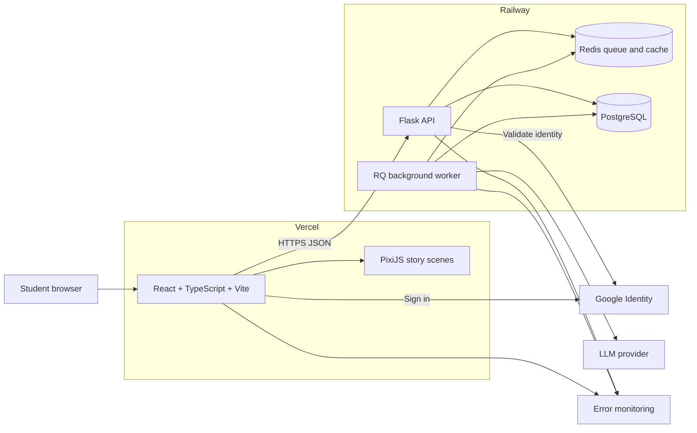
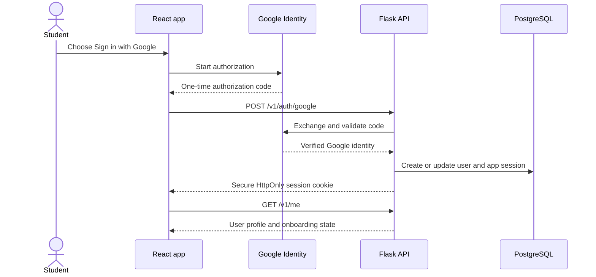
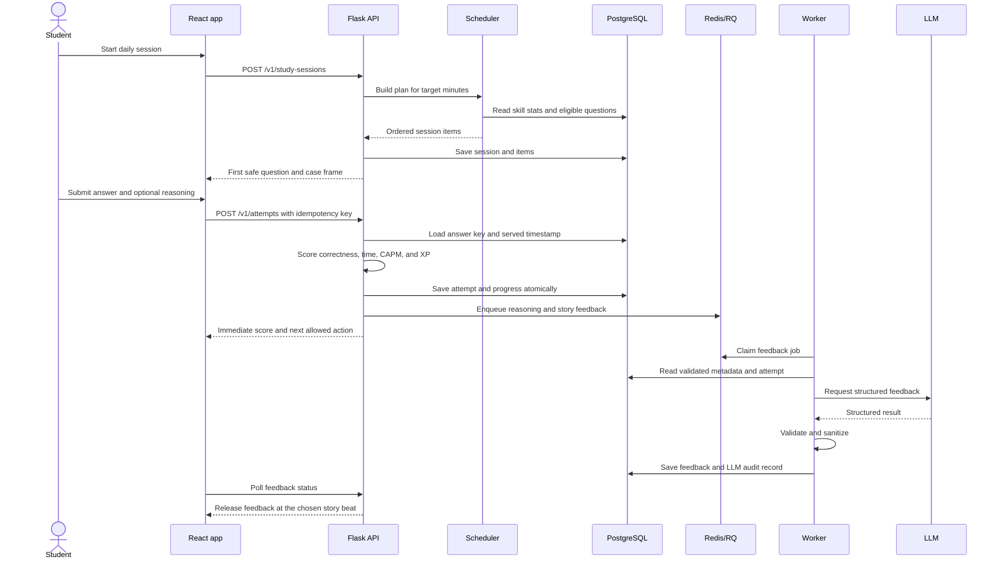
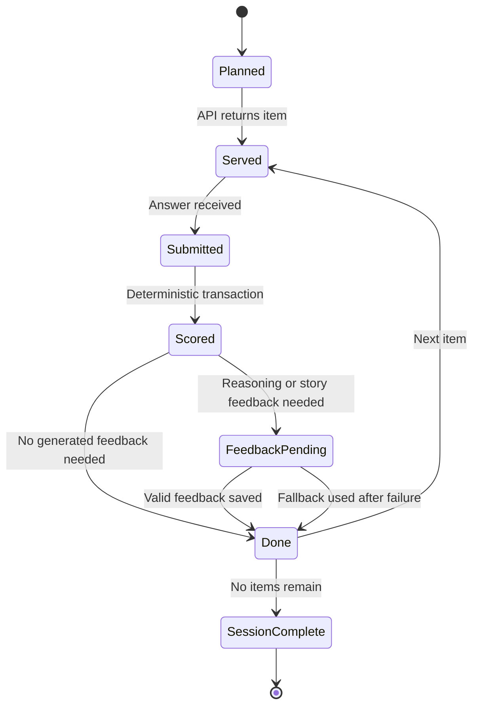
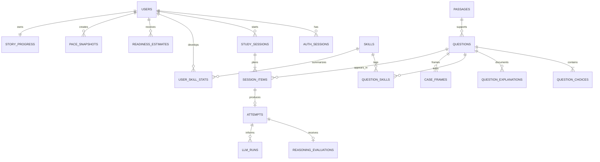
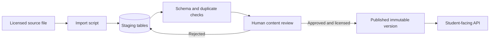
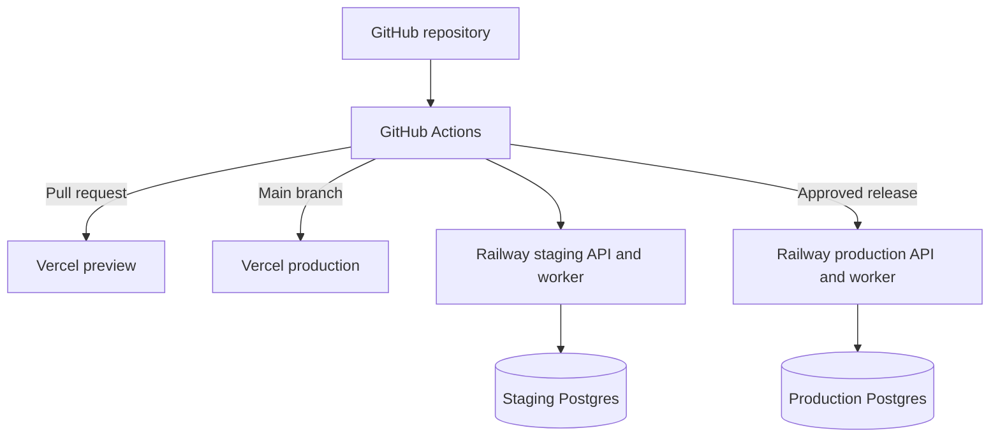

# LSAT Sherlock Web Architecture Plan

## 1. Goal

This document turns the product requirements in Final PRD.md into a buildable web architecture.

The most important rule is:

> Canonical LSAT content, answer scoring, timers, and saved progress must work without an LLM.

The LLM adds story framing and coaching. It never changes a question, decides whether an answer is correct, calculates CAPM, or calculates the readiness score.

## 2. Architecture at a glance

### Main parts

| Part | Responsibility |
| --- | --- |
| React web app | Authentication UI, diagnostic, study sessions, timers, answers, explanations, progress, and accessibility |
| PixiJS layer | 2D backgrounds, characters, transitions, and small animations |
| Flask API | Authentication, question delivery, deterministic scoring, session state, scheduler, readiness, CAPM, XP, and API authorization |
| PostgreSQL | Permanent source of truth for users, content, attempts, progress, generated content, and audit history |
| Redis and RQ | Background jobs, short-lived caching, retries, and job status |
| Background worker | LLM calls, story generation, reasoning evaluation, and other slow work |
| LLM provider | Structured story and coaching output only |

Redis is not a source of truth. If Redis is cleared, no student progress or question content should be lost.

## 3. Recommended repository structure

Use one repository so the frontend, backend, migrations, and API contract change together.

    LSATspeedrun/
      frontend/
        src/
          app/
          features/
            auth/
            diagnostic/
            study/
            story/
            progress/
          components/
          api/
          state/
          assets/
        tests/
      backend/
        app/
          api/
          auth/
          content/
          learning/
          scoring/
          scheduling/
          story/
          llm/
          jobs/
          models/
        migrations/
        tests/
      contracts/
        openapi.yaml
      scripts/
        import_questions/
      planning/
      .github/
        workflows/

The API contract lives in contracts/openapi.yaml. Generate TypeScript request and response types from it so the browser and Flask API agree on field names.

## 4. Frontend architecture

### Core choices

- React Router handles page and study-flow routes.
- TanStack Query owns server data, caching, retries, and request state.
- A small Zustand store owns temporary UI state such as the running timer, dialogue state, and Pixi scene state.
- React Hook Form and Zod validate answer and free-text explanation forms.
- PixiJS renders decoration only. Questions, choices, timers, forms, and feedback remain normal HTML.

Do not copy permanent learning state into a large client store. PostgreSQL is the source of truth, and TanStack Query should refetch or update it after API calls.

### Main routes

| Route | Purpose |
| --- | --- |
| /login | Google sign-in |
| /onboarding | Daily study-time preference and basic setup |
| /diagnostic | Resume or complete the 30–40 question diagnostic |
| /diagnostic/results | Readiness estimate, confidence, and weak areas |
| /study | Start or resume today’s session |
| /study/:sessionId | Active case and question flow |
| /session/:sessionId/summary | Accuracy, CAPM, XP, weak areas, and past-self comparison |
| /progress | Readiness history, skill performance, pace history, and saved progress |
| /settings | Study-time preference, account, data export, and deletion |

### Frontend feature boundaries

- auth knows how to establish and refresh an app session.
- diagnostic owns diagnostic progress and result screens.
- study owns the question state machine, timer, answer form, and session recovery.
- story owns dialogue, scene selection, and PixiJS presentation.
- progress owns readiness, skill, pace, and XP views.
- api is the only layer that makes HTTP requests.

### Timer behavior

The browser timer gives immediate visual feedback, but the server records authoritative timestamps.

- The API records when a session item is served.
- The browser sends active time, visibility changes, and its displayed elapsed time with the answer.
- The API records when the answer arrives and computes server elapsed time.
- CAPM uses bounded server elapsed time. Client activity data only helps identify long background pauses.
- Refreshing the page restores the same active item and timer from the server.

Because there are no public leaderboards, the MVP does not need aggressive anti-cheat logic.

### Accessibility

- All question content and answer controls must work without PixiJS.
- Keyboard navigation and visible focus states are required.
- Timers use accessible text and do not announce every second.
- Reduced-motion settings disable nonessential animations.
- Color is never the only way to show correctness or progress.

## 5. Backend architecture

Run Flask behind Gunicorn on Railway. Keep route handlers small. Route handlers validate input and call service modules; they should not contain scheduling, scoring, or prompt logic.

### Backend modules

| Module | Responsibility |
| --- | --- |
| auth | Google identity validation, app sessions, current user, logout |
| content | Safe question DTOs, choices, skills, explanations, and publishing rules |
| sessions | Diagnostic and daily study-session lifecycle |
| scoring | Correctness, elapsed time, CAPM, XP, and idempotent attempt creation |
| scheduling | Diagnostic blueprint and adaptive daily question selection |
| learning | Skill aggregates, weak areas, readiness estimate, and pace snapshots |
| story | Story state, case-frame lookup, feedback-release rules, and fallbacks |
| llm | Provider wrapper, prompts, structured schemas, output validation, and model versioning |
| jobs | RQ job definitions, retries, and dead-letter handling |
| api | Versioned HTTP endpoints and response schemas |

### Request rules

- All endpoints are versioned under /v1.
- Every request receives a request ID for logs and debugging.
- Every write checks the signed-in user on the server.
- Attempt submission requires an idempotency key so retries cannot create two attempts.
- Question responses never include the correct answer or validated explanations before submission.
- The API returns structured error codes, not raw exception messages.

## 6. Authentication

Use Google Identity Services for sign-in and a first-party application session after login.

Recommended production domains are app.lsatsherlock.com and api.lsatsherlock.com. This keeps the Vercel app and Railway API under the same parent site.

The application session cookie should be Secure, HttpOnly, short-lived, and rotated. Store only a hash of the session token in PostgreSQL. CORS must allow only known frontend origins, and state-changing cookie requests need CSRF protection.

## 7. Core study flow

### Session state

The current state is stored in PostgreSQL. A refresh, browser crash, or device change must resume from it.

## 8. Data architecture

Use one PostgreSQL database with clear logical boundaries:

- content contains canonical question content and reviewed metadata.
- learning contains users, study sessions, attempts, skill state, readiness, pace, and XP.
- story contains characters, story progress, case frames, and generated feedback.
- ops contains application sessions, LLM runs, prompt versions, and job audit data.

The runtime API role can read published content but cannot edit canonical question wording or answer keys. A separate admin/import role publishes content.

### Important tables

| Table | Important fields |
| --- | --- |
| users | id, Google subject ID, email, display name, target_minutes, created_at |
| auth_sessions | user_id, token_hash, expires_at, revoked_at |
| passages | id, canonical_text, content_hash, license_status, review_status, version |
| questions | id, optional passage_id, section, type, difficulty, stimulus_text, stem_text, content_hash, license_status, review_status, version |
| question_choices | question_id, label, canonical_text, is_correct |
| question_explanations | question_id, choice_id, explanation, review_status, version |
| skills | id, name, section, parent_skill_id |
| question_skills | question_id, skill_id, weight |
| study_sessions | user_id, mode, target_minutes, status, started_at, completed_at |
| session_items | session_id, question_id, order, requires_reasoning, release_policy, served_at, completed_at |
| attempts | session_item_id, selected_choice_id, is_correct, reasoning_text, server_elapsed_ms, client_active_ms, score_version |
| reasoning_evaluations | attempt_id, explanation_score, first_error_code, trap_code, hint, debrief, status |
| user_skill_stats | user_id, skill_id, accuracy, explanation_accuracy, average_time, recent_mistakes, sample_size |
| readiness_estimates | user_id, estimated_score, confidence_low, confidence_high, model_version, evidence_count |
| case_frames | question_id, story_version, structured_content, status, prompt_version |
| story_progress | user_id, chapter, XP, active_characters, state_json |
| pace_snapshots | user_id, session_id, CAPM, accuracy, difficulty_mix, baseline_type |
| llm_runs | task_type, model, prompt_version, input_hash, output_json, validation_status, latency_ms, cost |

### Database rules

- Use UUIDs for public identifiers.
- Use foreign keys and database constraints for core integrity.
- Save an attempt, its deterministic score, XP event, and session-item state in one transaction.
- Keep question versions immutable after publication. Corrections create a new version.
- Store a SHA-256 content hash for canonical stimulus, stem, and choices.
- Keep an append-only XP ledger instead of only a mutable XP total.
- Store timestamps in UTC.
- Add indexes for user session history, question eligibility, skill statistics, and pending jobs.

## 9. Question ingestion and publishing

Question content needs a controlled path into production.

The import process should check:

- Required stimulus, stem, choices, and answer key
- Duplicate content hashes
- Exactly one correct answer
- Valid section, question type, and difficulty
- Explanations for the correct and wrong choices
- License status and source reference
- Review status for LLM-generated metadata

Only published questions with an approved license status are eligible for sessions.

## 10. Diagnostic and readiness architecture

### Diagnostic selection

The diagnostic uses a fixed, versioned blueprint rather than the normal daily scheduler. The blueprint defines:

- Total question count between 30 and 40
- Logical Reasoning and Reading Comprehension coverage
- Question-type coverage
- Difficulty distribution
- Which items require a written explanation
- Time limits and item order rules

Version the blueprint so two users’ results can be understood later.

### Readiness calculation

The LLM does not calculate the score. A deterministic readiness service uses:

- Correctness by section and difficulty
- Diagnostic coverage
- Time spent
- Explanation scores where requested
- The versioned score-mapping configuration

The result contains an estimated LSAT score and a confidence range. Confidence is based on sample size, coverage, and consistency, not the LLM’s confidence. Until the mapping is calibrated with real outcome data, the UI must label it as an unofficial estimate.

Store every estimate with its model version and input summary so it can be reproduced.

## 11. Adaptive scheduler

### Daily session planning

The scheduler first filters to eligible questions:

- Published and approved for use
- In a modern LSAT section
- Not already used in the current session
- Not repeated too recently unless review is intentional
- Appropriate for the user’s current difficulty band
- Able to fit the selected 20–60 minute session

It then gives each candidate a need score. Initial configurable weights can be:

    30% accuracy gap
    25% explanation gap
    20% time gap
    15% recent-mistake signal
    10% interleaving bonus

The weights belong in a versioned configuration table, not scattered through route code.

For a new user with little history, use the diagnostic result and a balanced section blueprint. The session planner estimates question count from the user’s recent average time and fills the chosen time budget.

### Updating skill state

After an attempt:

1. Save deterministic correctness and timing.
2. Update quick aggregates needed for the next question.
3. When reasoning evaluation finishes, update explanation accuracy.
4. Record the algorithm version used.
5. Recompute the next full session plan only when needed.

The first MVP can update aggregates directly in the request transaction. Move heavier analytics to jobs only after load requires it.

## 12. CAPM and past-self comparisons

Use a simple, versioned formula. An initial default is:

    case points = difficulty weight × answer value
    answer value = 1.0 when correct, -0.25 when wrong
    CAPM = total case points / scored elapsed minutes

Accuracy remains separate and always visible.

### Accuracy gate

All questions are timed, but pace scoring turns on for a skill only after the student reaches the configured accuracy threshold. A reasonable starting rule is at least 80% accuracy across the latest 8 eligible attempts. Keep the threshold configurable.

### Fair comparisons

A ghost baseline should compare similar sessions. Match on:

- Session mode
- Approximate difficulty mix
- Main skills or section
- Minimum question count

Create immutable pace snapshots at session completion. Available baselines are previous session, seven-day history, thirty-day history, and personal best. Do not use public leaderboards in the MVP.

## 13. LLM and story architecture

### Keep the LLM off the critical path

Question delivery and answer submission must not wait for an LLM.

- Pre-generate and review reusable case frames when possible.
- At session creation, choose an existing compatible frame.
- Generate missing frames in a background job.
- Use a short template fallback if no valid frame is ready.
- Generate reasoning feedback and outcome dialogue after the answer is safely scored.

### Structured outputs

Every LLM task returns a strict JSON object.

Case frame:

    title
    brief
    presenting_character
    reason_to_evaluate
    pre_question_dialogue
    correct_outcome
    incorrect_outcome
    transition

Reasoning evaluation:

    explanation_score
    first_error_code
    trap_code
    hint
    debrief
    evaluation_confidence

Validate types, enums, and length limits before saving or displaying output. Invalid output is retried once and then replaced with a safe fallback.

### Prompt-injection protection

Student reasoning is untrusted data.

- Put it in a dedicated input field with a clear delimiter.
- Tell the model that text inside that field is evidence to analyze, never instructions.
- Give coaching jobs no tools, URLs, secrets, database access, or arbitrary retrieval.
- Pass only the minimum approved question metadata needed for the job.
- Limit input and output length.
- Require a strict output schema and allowlisted error/trap codes.
- Escape output before rendering; never render model-produced HTML.
- Log prompt version and input hash, but do not send raw student reasoning to analytics.
- Maintain an automated test set of prompt-injection and jailbreak attempts.

Prompt isolation reduces risk but does not make model output trusted. Schema validation and limited capabilities are the real security boundaries.

### Story continuity

Story progress stores a small set of controlled facts: current chapter, active characters, recurring antagonist, recent case outcomes, and XP. The LLM receives a compact summary, not the user’s full history.

The story can change how feedback is presented, but it cannot change which answer is correct or override the scheduler’s learning priorities.

### Feedback release

Each session item has a release policy:

- immediate
- end_of_case
- end_of_session

The server owns this policy. The frontend displays feedback only when the API marks it released.

## 14. API plan

### Authentication and user

| Method | Endpoint | Purpose |
| --- | --- | --- |
| POST | /v1/auth/google | Exchange Google code and create app session |
| POST | /v1/auth/logout | Revoke app session |
| GET | /v1/me | Current user and onboarding state |
| PATCH | /v1/me/preferences | Save daily time and accessibility preferences |
| DELETE | /v1/me | Request account and personal-data deletion |

### Study

| Method | Endpoint | Purpose |
| --- | --- | --- |
| POST | /v1/study-sessions | Start or resume diagnostic/daily session |
| GET | /v1/study-sessions/:id | Read session status |
| GET | /v1/study-sessions/:id/current | Restore or serve the current item; first response starts the server timer |
| POST | /v1/attempts | Submit answer and optional reasoning |
| GET | /v1/attempts/:id/feedback | Read feedback status and released content |
| POST | /v1/study-sessions/:id/complete | Complete session and create summary |
| GET | /v1/study-sessions/:id/summary | Accuracy, pace, XP, and weak-area changes |

### Progress

| Method | Endpoint | Purpose |
| --- | --- | --- |
| GET | /v1/dashboard | Today’s plan and current progress |
| GET | /v1/progress/skills | Skill-level accuracy, explanations, and timing |
| GET | /v1/progress/readiness | Readiness history and confidence |
| GET | /v1/progress/pace | CAPM history and available ghost baselines |
| GET | /v1/story/progress | Current chapter, characters, and XP |

Large question imports and content review should use protected admin tooling or command-line scripts, not student-facing endpoints.

## 15. Reliability and failure behavior

| Failure | Expected behavior |
| --- | --- |
| LLM is slow or down | Scoring succeeds immediately; use cached or template story; feedback shows as pending or falls back |
| Worker crashes | RQ retries with a limit; failed jobs move to a dead-letter queue |
| Duplicate answer request | Idempotency key returns the original attempt |
| Browser refreshes | Current session item and timer restore from PostgreSQL |
| Redis is cleared | Recreate pending jobs from database state; no permanent data is lost |
| Generated output fails validation | Retry once, then save a safe fallback and validation error |
| Question error is discovered | Unpublish that version; existing attempts retain their historical reference |
| Database transaction fails | No partial attempt, XP, or session progress is committed |
| Story assets fail | The HTML study interface still works |

Start with these service targets:

- p95 safe-question response under 800 ms
- p95 answer scoring under 500 ms
- Progress committed before success is returned
- Background feedback usually available within 10 seconds
- No LLM dependency in authentication, question delivery, or scoring

## 16. Security and privacy

- TLS is required everywhere.
- Keep all secrets in Vercel and Railway secret stores.
- Use exact CORS allowlists, CSRF protection, secure headers, and a restrictive Content Security Policy.
- Rate-limit login, answer submission, and LLM-triggering endpoints.
- Never log answer keys in frontend logs.
- Redact cookies, tokens, raw reasoning, email addresses, and full question content from error reports.
- Encrypt managed databases and backups at rest.
- Support account deletion and personal-data export.
- Keep canonical content access auditable.
- Back up PostgreSQL automatically and test restoration before production.
- Use separate development, staging, and production credentials and databases.

## 17. Observability

Use structured JSON logs from Flask and the worker. Every request, job, attempt, and LLM run should have linked IDs.

Track:

- API latency and error rate
- Answer-submission success
- Queue age and failed jobs
- LLM latency, validation failures, and cost
- Session start and completion
- Diagnostic completion
- Feedback availability time
- Scheduler question distribution

Use Sentry or an equivalent tool for frontend and backend errors. Product analytics may track events, but it must not receive raw questions, answers, or student reasoning.

## 18. Testing strategy

### Unit tests

- Correctness and answer-key isolation
- Timer and CAPM formulas
- Accuracy gate
- Scheduler weights and eligibility
- Readiness mapping
- XP ledger
- Feedback release policy
- Prompt-output validators

### Integration tests

- Google identity test flow
- Study-session creation
- Attempt transaction and idempotency
- PostgreSQL constraints and migrations
- RQ job retry and fallback
- Safe question DTO never exposing the answer

### End-to-end tests

Use Playwright for:

- Sign in and onboarding
- Complete a small test diagnostic
- Start, refresh, and resume a session
- Submit correct and incorrect answers
- Receive delayed feedback
- Complete a session and see saved progress
- Use the core flow with PixiJS disabled

### LLM evaluation tests

Maintain a fixed set of reviewed questions, good and bad student explanations, prompt-injection attempts, expected error codes, and maximum output lengths. Run it whenever a prompt or model changes.

## 19. Deployment and environments

The CI pipeline should:

1. Lint and type-check TypeScript and Python.
2. Run unit and integration tests.
3. Build the frontend.
4. Validate the OpenAPI contract.
5. Run migration checks.
6. Deploy previews for pull requests.
7. Run production migrations as a controlled release step before new backend code.

Do not run destructive or irreversible migrations in the same release that first depends on them. Use expand, migrate data, switch code, then contract.

## 20. Build order

### Week 1: deterministic core

- Create the frontend and backend skeletons.
- Set up PostgreSQL, Alembic, OpenAPI, and CI.
- Implement Google sign-in and app sessions.
- Create content, study-session, session-item, and attempt tables.
- Import a small approved seed question set.
- Deliver a safe question and score an answer end to end.
- Deploy a preview.

### Week 2: diagnostic and story

- Add the versioned diagnostic blueprint.
- Add readiness estimate and weak-area output.
- Add Redis, RQ, LLM provider wrapper, and structured schemas.
- Add cached case frames and template fallbacks.
- Add reasoning evaluation and release policies.
- Add simple PixiJS scenes without coupling them to question controls.

### Week 3: adaptive practice and speed

- Add user skill aggregates and daily session planning.
- Add the versioned scheduler weights.
- Add CAPM, the accuracy gate, and pace snapshots.
- Add previous-session and personal-best ghost comparisons.
- Add progress and session-summary screens.

### Week 4: hardening and user testing

- Add retries, dead-letter handling, rate limits, and redaction.
- Add accessibility and reduced-motion checks.
- Add end-to-end and prompt-injection tests.
- Add monitoring, backups, and restore testing.
- Test with pre-law students and fix the largest completion blockers.

## 21. Decisions still needed

These choices do not block writing the application skeleton, but they must be settled before production:

1. Question source, license terms, and publishing workflow
2. LLM provider and models for story versus reasoning feedback
3. Initial diagnostic blueprint and score-mapping table
4. Initial skill taxonomy and question-type taxonomy
5. Exact CAPM difficulty weights, wrong-answer penalty, and accuracy threshold
6. Brand domain and Google OAuth production configuration
7. Data-retention period for raw student reasoning and LLM audit records

## 22. Definition of architecture-ready

The architecture is ready to build when:

- The seven decisions above have owners, even if some values remain provisional.
- The OpenAPI contract covers login, session creation, question delivery, attempt submission, feedback, and progress.
- The first database migration contains the deterministic core tables.
- A seed question can be imported with an approved license status.
- The team agrees that the LLM is never required for correctness, timing, progress saving, or session recovery.
